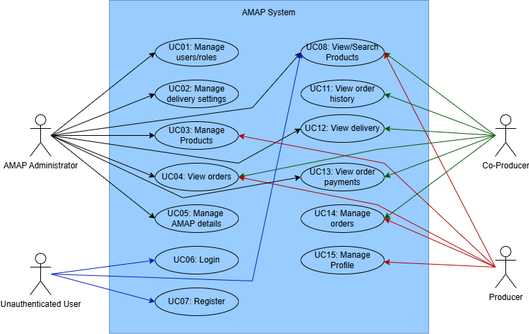
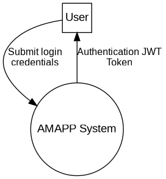
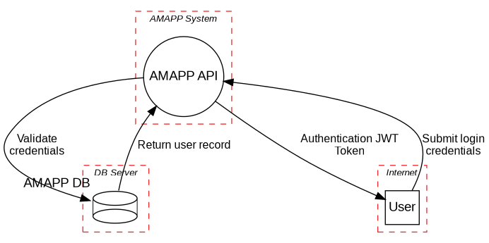
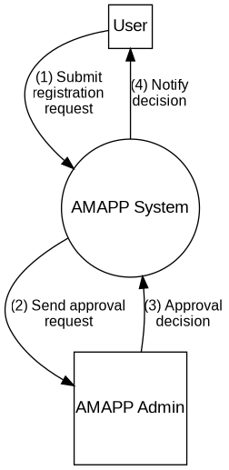
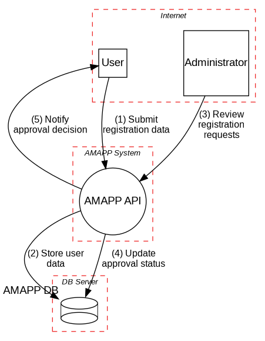

|  |  |
| :-----------------------------: | :---------------------------------------------: |

# Phase 1: Threat Modeling

**_Group desofs2025_mon_ffs_2_**
*DESOFS*

**Master in Informatics Engineering - 2024/2025**

**Students:**
Ilídio Magalhães - 1191577  
Hugo Coelho - 1162086  
Pedro Oliveira - 1240482  
Paulo Abreu - 1240481  
...
**Location:** Porto, April 27, 2025

---

## Table of Contents

- [Phase 1: Threat Modeling](#phase-1-threat-modeling)
  - [Table of Contents](#table-of-contents)
  - [Introduction](#introduction)
  - [Project Analysis](#project-analysis)
    - [Project description](#project-description)
    - [Domain Model](#domain-model)
    - [Component Diagram](#component-diagram)
      - [Components:](#components)
      - [Connections:](#connections)
      - [Deployment:](#deployment)
    - [Threat Model Information](#threat-model-information)
      - [Methodology](#methodology)
      - [Supplementary Methodologies](#supplementary-methodologies)
      - [Scope](#scope)
    - [Assumptions](#assumptions)
    - [Assets](#assets)
  - [Entry Points and Exit Points](#entry-points-and-exit-points)
    - [Entry Points](#entry-points)
    - [Exit Points](#exit-points)
    - [Application Users](#application-users)
      - [Producer](#producer)
      - [Co-Producer](#co-producer)
      - [AMAP Administrators](#amap-administrators)
    - [Use Cases](#use-cases)
    - [Functional Requirements](#functional-requirements)
    - [UC01 - Manage Users/Roles](#uc01---manage-usersroles)
    - [UC02 - Manage Delivery Settings](#uc02---manage-delivery-settings)
    - [UC03 - Manage Products](#uc03---manage-products)
    - [UC04 - View Orders](#uc04---view-orders)
    - [UC05 - Manage AMAP Details](#uc05---manage-amap-details)
    - [UC06 - Login](#uc06---login)
    - [UC07 - Register](#uc07---register)
    - [UC08 - View/Search Products](#uc08---viewsearch-products)
    - [UC09 - Manage Orders](#uc09---manage-orders)
    - [UC10 - View Order History](#uc10---view-order-history)
    - [UC11 - View Delivery](#uc11---view-delivery)
    - [UC12 - View Order Payments](#uc12---view-order-payments)
    - [UC13 - Manage Profile](#uc13---manage-profile)
    - [Non-Functional Requirements](#non-functional-requirements)
    - [1. Performance](#1-performance)
    - [2. Availability](#2-availability)
    - [3. Scalability](#3-scalability)
    - [4. Security](#4-security)
    - [5. Reliability and Integrity](#5-reliability-and-integrity)
    - [6. Maintainability](#6-maintainability)
    - [7. Portability](#7-portability)
    - [8. Monitoring and Alerts](#8-monitoring-and-alerts)
    - [Security Requirements](#security-requirements)
      - [Functional Security Requirements (CIA-Based)](#functional-security-requirements-cia-based)
        - [Confidentiality](#confidentiality)
        - [Integrity](#integrity)
        - [Availability](#availability)
      - [Non-Functional Security Requirements](#non-functional-security-requirements)
      - [Secure Development Requirements](#secure-development-requirements)
        - [1. Secure Coding Guidelines](#1-secure-coding-guidelines)
        - [2. Dependency Management](#2-dependency-management)
        - [3. Secure Code Review](#3-secure-code-review)
        - [4. Static Application Security Testing (SAST)](#4-static-application-security-testing-sast)
        - [5. Secure Build and Deployment](#5-secure-build-and-deployment)
        - [6. Logging and Monitoring](#6-logging-and-monitoring)
        - [7. Development of Automated Security Tests](#7-development-of-automated-security-tests)
    - [External Dependencies](#external-dependencies)
  - [Data Flow Diagrams](#data-flow-diagrams)
    - [Authentication](#authentication)
      - [Level 0](#level-0)
      - [Level 1](#level-1)
    - [Create Product](#create-product)
      - [Level 0](#level-0-1)
      - [Level 1](#level-1-1)
    - [Generic Representation](#generic-representation)
      - [Level 0](#level-0-2)
      - [Level 1](#level-1-2)
    - [Order Payments Deliveries Reports](#order-payments-deliveries-reports)
      - [Level 0](#level-0-3)
      - [Level 1](#level-1-3)
    - [Product Reservation](#product-reservation)
      - [Level 0](#level-0-4)
      - [Level 1](#level-1-4)
    - [Registration](#registration)
      - [Level 0](#level-0-5)
      - [Level 1](#level-1-5)
    - [User Management](#user-management)
      - [Level 0](#level-0-6)
      - [Level 1](#level-1-6)
  - [STRIDE](#stride)
    - [Authentication](#authentication-1)
    - [Create Product](#create-product-1)
    - [Order Payments Deliveries Reports](#order-payments-deliveries-reports-1)
    - [Product Reservation](#product-reservation-1)
    - [Registration](#registration-1)
    - [User Management](#user-management-1)
  - [Risk Assessment](#risk-assessment)
    - [Risk Register](#risk-register)
  - [Use Cases and Abuse Cases](#use-cases-and-abuse-cases)
    - [Authentication And Registration](#authentication-and-registration)
      - [**Use Cases**](#use-cases-1)
      - [**Abuse Cases**](#abuse-cases)
      - [**Countermeasures**](#countermeasures)
    - [Create Product](#create-product-2)
      - [**Use Cases**](#use-cases-2)
      - [**Abuse Cases**](#abuse-cases-1)
      - [**Countermeasures**](#countermeasures-1)
    - [Order Payments Deliveries Reports](#order-payments-deliveries-reports-2)
      - [**Use Cases**](#use-cases-3)
      - [**Abuse Cases**](#abuse-cases-2)
      - [**Countermeasures**](#countermeasures-2)
    - [Product Reservation](#product-reservation-2)
      - [**Use Cases**](#use-cases-4)
      - [**Abuse Cases**](#abuse-cases-3)
      - [**Countermeasures**](#countermeasures-3)
    - [User Management](#user-management-2)
      - [**Use Cases**](#use-cases-5)
      - [**Abuse Cases**](#abuse-cases-4)
      - [**Countermeasures**](#countermeasures-4)
  - [Conclusion](#conclusion)

---

## Introduction

This report documents the comprehensive threat modeling process conducted for the AMAP system, a platform designed to connect local agricultural producers directly with consumers through a sustainable pre-ordering model. The threat modeling analysis aims to identify, categorize, and recommend mitigations for potential security vulnerabilities before they can be exploited in a production environment.

We employed a Software-Centric approach to threat modeling, evaluating the application from its core architecture outward, determining risks at each component level, and identifying appropriate controls. Our methodology leverages the STRIDE framework (Spoofing, Tampering, Repudiation, Information Disclosure, Denial of Service, and Elevation of Privilege) to systematically categorize threats across the system's attack surface.

The scope of our analysis encompasses all critical components of the AMAP platform, including user authentication and registration, product catalog management, order processing, and delivery management. Using Data Flow Diagrams (DFDs) at both context and detailed levels, we visualized how data moves through the system and identified potential security weaknesses at trust boundaries and processing points.

This report presents our findings organized by system module, with each section containing:

- Data Flow Diagrams illustrating component interactions
- STRIDE-based threat analysis tables
- Use and Abuse Cases demonstrating legitimate usage patterns alongside potential attack scenarios
- Detailed mitigation recommendations for identified vulnerabilities

By identifying and addressing security concerns early in the development lifecycle, this threat model serves as a foundation for building a robust, secure platform that protects sensitive user data while maintaining the integrity of the AMAP ecosystem and supporting its mission of sustainable agriculture.

---

## Project Analysis

### Project description

This product is designed to enhance the AMAP (Associação para a Mobilização de Alimentos e Produtos) initiative, a Portuguese organization that connects local producers directly with consumers. AMAP's core model is based on pre-ordering, where consumers place orders before the production cycle begins, ensuring that only the requested products are produced. This reduces food waste, supports local agriculture, and promotes sustainability. AMAP’s principles include sustainability, transparency, local consumption, and community engagement.

The primary objectives of AMAP are to promote sustainable agricultural practices, provide consumers with transparency about the food they purchase, support local economies, and foster community ties between consumers and producers. The system being specified will automate processes like order management, production planning, inventory tracking, and delivery logistics, improving efficiency while maintaining AMAP's core values.

This system will ensure a seamless flow from order to delivery, improving overall operational efficiency. This will help the AMAP to better manage its processes and provide a more transparent and sustainable service to its consumers.

---

### Domain Model

This class diagram represents the **core data structure** of the AMAPP platform, outlining the main entities involved in the management of orders between co-producers and producers.

- The base class `User` is extended by three user types: `Producer`, `AMAPAdministrator`, and `CoProducer`, each with specific roles.
- Producers can **create products**, which are tracked in an associated `Inventory` component.
- Co-producers can **place orders** (`Order`), which consist of multiple `OrderItem` elements, each linked to a specific product.
- Orders can be linked to **payments** and **deliveries**, managed by the `Payment` and `Delivery` classes respectively.
- The `AMAPAdministrator` manages delivery dates and logistics.
- Inventory updates are reflected based on `OrderItem` activity.

---

### Component Diagram

This diagram shows the main components of the AMAPP system and how they interact.

#### Components:

- **AMAP System**: The main container for all modules.
- **AMAP BackEnd**: Handles business logic.
- **AMAP Database**: Stores the system's data.
- **AmapDB_API**: Connects the backend to the database.
- **AMAP API**: Allows the frontend or other systems to use backend services.

#### Connections:

- The **AMAP API** connects to the **BackEnd** to request operations or data.
- The **BackEnd** uses the **AmapDB_API** to access the **Database**.

#### Deployment:

- The system will run with the backend and APIs.
- The database is hosted on a remote server

---

### Threat Model Information

The threat modeling for the AMAP system follows a **Software-Centric** approach to identify and evaluate potential security risks within the platform. This section outlines our methodology, scope for the threat modeling process.

#### Methodology

Our threat modeling process is based on PyTM (Python Threat Modeling), an open-source framework that provides a code-driven approach to threat modeling. While we leverage the STRIDE threat categorization concepts, our implementation is done through PyTM, which allows us to:

- Programmatically define the system architecture
- Generate Data Flow Diagrams (DFDs) automatically
  -Identify threats using predefined rules and templates
- Document potential attacks and mitigations systematically

The STRIDE approach helps us identify threats across six key categories:

- **Spoofing**
  Impersonation of users or system components
- **Tampering**
  Unauthorized modification of data
- **Repudiation**
  Denial of performing actions without others being able to prove otherwise
- **Information Disclosure**
  Exposure of sensitive information
- **Denial of Service**
  Making the system unavailable to legitimate users
- **Elevation of Privilege**
  Gaining unauthorized access to restricted functionality

#### Supplementary Methodologies

To bolster our threat modeling, we also employed:

- **Data Flow Diagrams (DFDs)**
  Visualize system components and their interactions
- **Abuse Cases**
  Model potential attack scenarios

#### Scope

The threat model encompasses all key components of the AMAP system:

- **User Authentication and Authorization**
- **User Registration and Management**
- **Product Catalog Management**
- **Order Processing and Reservation System**
- **Delivery Management**
- **Reporting Functionality**

### Assumptions

- The database is hosted on a separate server as specified in the system architecture

### Assets

Based on our analysis, we identified the following critical assets requiring protection:

- **User Authentication Credentials**: Passwords and session tokens that could be used to impersonate legitimate users
- **Personal User Information**: Names, addresses, contact information, and other PII protected under privacy regulations
- **Product Information**: Details about products, inventory, and pricing that must maintain integrity
- **System Configuration**: Settings that control the behavior of the application and could be misused if compromised

## Entry Points and Exit Points

### Entry Points

Entry points represent the interfaces through which data enters the AMAPP system from external sources:

**1 - API Endpoints**

- Authentication endpoints for user login
- Registration endpoints for new user creation
- Product management endpoints (create, update, list)
- Order submission endpoints
- Report generation endpoints
- User management endpoints for administrators

**2- File Upload Interfaces**

- Product image upload API endpoints
- Document submission API endpoints (e.g., certifications)

**3 - Database Connection**

- Connection strings to the database server
- Database authentication credentials used by the API

### Exit Points

Exit points represent interfaces through which data leaves the AMAPP system:

**1 - API Responses**

- JSON data responses to client requests
- Authentication tokens issued to authenticated clients
- Error messages and validation results
- Success/failure status codes for operations
- PDF file downloads returned to clients when reports are requested

**2 - Database Operations**

- SQL queries to store, retrieve, or modify data
- Database backup operations

**3 - System Logs**

- API access logs with operation details
- Security event logs
- Error and exception logs

---

### Application Users

#### Producer

Responsible for the production and management of products available within the AMAP system, the producer is the main supplier in the community. Producers update the platform with information about product availability, production cycles, and inventory, which allows consumers to know exactly what is available each quarter. In addition, they ensure that production aligns with the orders placed beforehand, minimizing waste and maximizing sustainability. This user class has permissions to manage and adjust production data, keeping operations synchronized with consumer orders.

#### Co-Producer

Also known as co-producers, consumers play an active role in AMAP's sustainable model by ordering products directly from producers. These users engage in a long-term commitment, supporting local consumption and securing regular orders, typically on a quarterly basis. They have access to detailed information about the products, origin, and production practices, and can track order status up to delivery. Although they do not have permissions to modify production data, this user class can access product inquiry and ordering functions, along with resources that support sustainable consumption.

#### AMAP Administrators

These users oversee the operational management of the system within AMAP. Acting as intermediaries between producers and consumers, they ensure data accuracy on the platform, address user issues or questions, and uphold AMAP’s values of sustainability and transparency. AMAP administrators have the authority to edit and review system content, facilitate updates or changes in practices, and ensure that digital operations align with organizational objectives. They also handle user support issues and facilitate communication among the different stakeholders.

---

### Use Cases

The use case diagram above illustrates the interactions between the main actors of the AMAP system and its functionalities. The identified actors are: Unauthenticated User, Co-Producer, Producer, and AMAP Administrator. Each actor interacts with the system through specific use cases that reflect their roles and responsibilities within the platform. This diagram provides a high-level view of the system's functional scope and user access paths.

---

### Functional Requirements

The functional requirements listed below are organized by use case and describe the essential system functionalities expected to be implemented. Each requirement corresponds to an action or capability that the system must support to fulfill user needs, aligned with their roles and privileges. These requirements serve as the foundation for the system’s behavior and guide the development and testing phases.

### UC01 - Manage Users/Roles

- **REQ-01**: Add a role to a user.
- **REQ-02**: Change user role.
- **REQ-03**: View current role configurations.
- **REQ-04**: Modify criteria and role permissions.

### UC02 - Manage Delivery Settings

- **REQ-05**: Create the delivery settings.
- **REQ-06**: Update the delivery settings.

### UC03 - Manage Products

- **REQ-07**: Add new products to the catalog.
- **REQ-08**: Update existing product information.
- **REQ-09**: Deactivate products from the catalog.

### UC04 - View Orders

- **REQ-10**: Display all active and completed orders.
- **REQ-11**: Provide detailed information for each order.
- **REQ-12**: Allow filtering and sorting orders by date, status, product, co-producer or producer.
- **REQ-13**: Provide detailed information for each order.

### UC05 - Manage AMAP Details

- **REQ-14**: View current AMAP information.
- **REQ-15**: Update location details and contact information.

### UC06 - Login

- **REQ-16**: Authenticate users based on entered credentials and role privileges.
- **REQ-17**: Recover user account password via a recovery link or code sent to a registered email or phone number.

### UC07 - Register

- **REQ-18**: Create a new user account.

### UC08 - View/Search Products

- **REQ-19**: View list of products from the AMAP, with filtering options for product type, producer, and availability.
- **REQ-20**: View detailed information about a product, including information about the producer, type, and availability.

### UC09 - Manage Orders

- **REQ-21**: Co-producer can make new order.
- **REQ-22**: Co-producer can see the details of their orders.
- **REQ-23**: Co-producer can update their orders.
- **REQ-24**: Producer can see the list of orders for their products.
- **REQ-25**: Producer can update orders that contain their products.

### UC10 - View Order History

- **REQ-26**: Provides access to a comprehensive history of all past orders within the AMAP, including key details such as requested products and order status. It also allows the actor to filter the history by parameters like product, date, or status to easily locate specific orders.

### UC11 - View Delivery

- **REQ-27**: Access detailed information about scheduled deliveries, including date, address, and delivered products, and can filter deliveries by criteria such as date or delivery status.
- **REQ-28**: View detailed information about the status of each delivery, such as "pending", "in progress", or "completed".

### UC12 - View Order Payments

- **REQ-29**: Co-producer has access to the history of all payments made within the system, displaying relevant details such as date, amount paid, and payment status, and allow filtering of the payment history by date, amount, and payment status.
- **REQ-30**: AMAP Admin can access the payment history of each co-producer.

### UC13 - Manage Profile

- **REQ-31**: The actor is capable of viewing and editing profile details, including address, contact information, and other personal data.
- **REQ-32**: The actor can upload important documents, such as organic certification or other credentials, to verify their qualifications.

---

### Non-Functional Requirements

The non-functional requirements define quality attributes and technical constraints that the AMAPP system must meet, ensuring robustness, performance, and ease of use and maintenance.

### 1. Performance

- The system must respond to user requests in under 1 second under normal operating conditions.
- The API must be capable of processing at least 100 requests per second in a production environment, ensuring low latency and high throughput.
- Page load times in the frontend should not exceed 2 seconds in 95% of accesses.

### 2. Availability

- The application must be available to users 24/7, except during scheduled maintenance periods.
- The infrastructure must ensure **fault tolerance**, maintaining functionality of at least one critical component (API, database, frontend) in case of partial failure.
- The system must achieve a **minimum availability of 99%** during regular operating hours (08:00–22:00).

### 3. Scalability

- The system architecture must support **horizontal scalability**, allowing backend services to run in multiple instances.
- The system must handle up to **3 times the average number of active users** without noticeable performance degradation.
- Storage and processing capacity should be adjustable dynamically according to demand.

### 4. Security

- All communication between client and server must be encrypted via **HTTPS/TLS**.
- Authentication must be implemented using **secure, expiring tokens (e.g., JWT)**, with support for refresh tokens.
- The system must enforce **role-based access control** (e.g., AMAP manager, producer, co-producer).
- Measures must be in place to protect against common attacks such as **SQL Injection, XSS, CSRF, and brute-force login attempts**.
- Passwords must be securely stored using strong hashing algorithms (e.g., bcrypt or Argon2).

### 5. Reliability and Integrity

- Critical operations (e.g., orders and payments) must guarantee **persistence and atomicity**, even in the event of partial failures.
- There must be **error and event logging** for **auditability** and recovery.
- The system must follow the **ACID principle** for relational database operations, and eventual consistency for MongoDB operations.

### 6. Maintainability

- The code must follow **software engineering best practices**, such as separation of concerns, design patterns, and documentation.
- The system must allow for **modular updates**, enabling new features to be added without requiring full downtime.
- There should be **test coverage above 80%** for critical features, including unit, integration, and acceptance tests.

### 7. Portability

- The application must be **compatible with Linux environments**, preferably via **Docker containers** orchestrated with **Kubernetes**.
- The API must follow **RESTful standards**, enabling future integration with other systems and external services.
- The system should be easily deployable in both local and cloud environments.

### 8. Monitoring and Alerts

- The system must expose **technical metrics** (CPU, memory, latency, throughput, etc.) compatible with tools like **Prometheus and Grafana**.
- There must be **automatic alerts** for critical errors, service failures, or performance degradation, ensuring rapid response to incidents.
- Logs must be centralized and analyzable with tools such as the **ELK Stack** or **Grafana Loki**.

---

### Security Requirements

This report pulls together AMAPP’s security requirements by CIA (confidentiality, integrity, availability), includes a checklist mapped to functional/non-functional specs, and uses PyTM-generated DFDs, abuse cases, and CAPEC/CWE threat reports to cover every risk.

#### Functional Security Requirements (CIA-Based)

##### Confidentiality

- FS01: The system must authenticate all users (OAuth 2.0, JWT).
- FS02: The system must enforce role-based access control (RBAC).
- FS03: All communication must use HTTPS/TLS.
- FS04: Sensitive data must be encrypted in transit and at rest.
- FS05: Authentication tokens must be unique per session and revocable.

##### Integrity

- FS06: All input must be validated and sanitized (whitelisting, type, size).
- FS07: Protection against injection attacks (SQL, XML, LDAP, etc.).
- FS08: Audit logs must be tamper-proof and protected from modification.
- FS09: Error messages must not expose internal system details.

##### Availability

- FS10: The system must implement rate limiting and DoS protections (flooding, resource exhaustion).
- FS11: Regular, automated backups must be supported and tested.
- FS12: The system must support high availability (clustering, replication).

---

#### Non-Functional Security Requirements

- NFS01: System uptime must be ≥ 99.5% under load.
- NFS02: The system must scale horizontally without compromising security.
- NFS03: Audit logs must ensure integrity via hashing or signing.
- NFS04: Real-time anomaly detection and alerting must be in place.
- NFS05: Incident response time must be ≤ 2 hours.
- NFS06: MFA must not degrade system performance by more than 15%.
- NFS07: Backup recovery must take no longer than 30 minutes.
- NFS08: Incident response procedures must be documented.
- NFS09: Logs must be protected and retained for at least one year.

---

#### Secure Development Requirements

These are required activities during software development to ensure that application software does not contain vulnerabilities.

##### 1. Secure Coding Guidelines

- Follow recognized standards such as [OWASP Secure Coding Practices](https://owasp.org/www-project-secure-coding-practices-quick-reference-guide/), CERT Secure Coding Standards, or Microsoft's Secure Coding Guidelines.
- Apply best practices:
  - Strict input validation.
  - Strong authentication and secure session management.
  - Proper use of cryptography.
  - Secure error and exception handling (e.g., no stack trace exposure).
  - Principle of least privilege.

##### 2. Dependency Management

- Monitor third-party libraries and frameworks.
- Quickly update vulnerable dependencies.
- Avoid using unmaintained or suspicious packages.

##### 3. Secure Code Review

- Perform security-focused code reviews for all new code and major changes.
- Use automated tools (e.g., SonarQube) to assist but not replace manual review.
- Focus areas:
  - Critical components like authentication, authorization, and data access.
  - Common vulnerability patterns (SQL Injection, XSS, CSRF, etc.).
  - Business logic errors that could be exploited.

##### 4. Static Application Security Testing (SAST)

- Use static code analysis tools (e.g., SonarQube) integrated in CI/CD pipelines to detect vulnerabilities early.

##### 5. Secure Build and Deployment

- Ensure builds are automated, reproducible, and conducted in controlled environments.
- Prevent secret exposure (keys, passwords) in repositories or pipelines.

##### 6. Logging and Monitoring

- Implement secure logging of security-relevant events (e.g., logins, unauthorized access attempts, critical errors).
- Ensure logs do not contain sensitive information (e.g., passwords, credit card numbers).

##### 7. Development of Automated Security Tests

- Create and maintain automated security tests as part of the development lifecycle.
- Integrate security tests into the CI/CD pipeline to continuously validate code security.
- Cover common vulnerabilities such as injection flaws, authentication issues, and access control weaknesses.
- Include unit tests focused on validating security-related functions.
- Implement integration tests to verify secure interactions between different components.
- Develop end-to-end tests to simulate real-world security scenarios and verify protection mechanisms.

> **Note:** These requirements must be continuously reviewed and updated to adapt to evolving security threats.

---

### External Dependencies

This project will rely on external libraries and tools to provide key features—authentication (JWT), PDF generation, input validation, PostgreSQL connectivity and migrations, and CI/CD automation via GitHub Actions. All of these will be managed as NuGet packages (for runtime and build-time dependencies) and GitHub Actions workflows, under the umbrella of the .NET 8.0 SDK and runtime. Proper version control, security and update processes will be applied to maintain stability and integrity.

---

## Data Flow Diagrams

Data Flow Diagrams (DFDs) are used to graphically represent the flow of data within a business information system. In the context of the AMAPP project, which aims to manage users, products, orders, subscriptions, and deliveries in an AMAP environment, DFDs serve as a valuable tool to understand how the application handles and processes data across its various components.

The use of DFDs in this project allows us to gain a clearer understanding of the application by providing a visual representation of how data moves through the system and what transformations or processes occur along the way. Rather than focusing on implementation details, DFDs emphasize the flow of information — such as user authentication, order creation, or payment processing — between different parts of the system.

DFDs are hierarchical in structure, which makes them particularly useful for decomposing the application into subsystems and lower-level components. A high-level DFD (Level 0) will help us define the scope of the system by showing the application as a single process interacting with external entities such as producers, co-producers (clients), and administrators. Subsequent lower-level diagrams (Level 1 and beyond) will then break down the main process into more specific internal operations, such as managing subscriptions, scheduling deliveries, or handling payment validation.

By using DFDs at different levels of abstraction, we ensure a structured approach to analyzing the system’s requirements and logic, making it easier to communicate the system's behavior to all stakeholders involved in the development process.

### Authentication

#### Level 0

The Level 0 Data Flow Diagram (DFD) provides a high-level overview of the **user authentication process** within the AMAPP application. This diagram illustrates the basic interaction between an external actor (the user) and the internal AMAPP authentication system.

- **External Actor:**

  - `User`: Any actor (e.g., co-producer, producer, or AMAPP admin) attempting to log in to the system.
- **Main Process:**

  - `AMAPP System`: The internal authentication service responsible for validating login credentials and issuing authentication tokens.
- **Data Flows:**

  - `Submit login credentials`: The user submits their login details (e.g., email and password) to the AMAPP system via a secure HTTPS connection.
  - `Authentication JWT Token`: Upon successful verification, the system responds with a JSON Web Token (JWT) which allows the user to access protected endpoints in future requests.

This context-level diagram defines the **boundary between the user and the system**, emphasizing what data is exchanged during the authentication process without yet detailing how the credentials are validated internally or how the JWT is generated and stored.

#### Level 1

The Level 1 Data Flow Diagram (DFD) refines the context-level view of the user authentication process by decomposing the **AMAPP API** into internal subprocesses and detailing how data flows through the system. It also introduces data storage components and defines clear **trust boundaries**.

- **External Actor:**

  - `User`: An individual (e.g., co-producer, producer, or administrator) attempting to authenticate and gain access to the AMAPP platform.
- **Subprocesses:**

  - `Receive Credentials`: Handles the initial reception of login credentials (username/email and password) from the user.
  - `Fetch User Record`: Queries the database to retrieve the stored user record corresponding to the submitted credentials.
  - `Validate Credentials`: Compares the submitted credentials with the stored hash (e.g., using password hashing functions).
  - `Generate Token`: If validation is successful, creates a signed JWT (JSON Web Token) to be used in subsequent authenticated requests.
  - `Return Token`: Sends the authentication token back to the user.
- **Data Storage:**

  - `AMAPP DB`: The internal database where user records are securely stored, including hashed passwords and roles.
- **Data Flows:**

  - `Submit login credentials`: The user submits their authentication details to the API.
  - `Request user record`: The API requests the corresponding user data from the database.
  - `Return user record`: The database sends the user’s stored information (e.g., hashed password) back to the API.
  - `Validated result`: The outcome of the credential validation is passed to the token generator.
  - `Generated JWT`: A secure token is created for the session.
  - `Authentication JWT Token`: The token is returned to the user as proof of successful authentication.
- **Trust Boundaries:**

  - `Internet Zone`: External environment where the user resides.
  - `AMAPP System Zone`: The internal API and authentication logic, trusted but must validate all inputs.
  - `Database Zone`: A protected area where sensitive user data is stored, with stricter access controls and security policies.

This detailed diagram provides a more granular view of how the authentication workflow operates, highlighting not only the logical flow of data but also the interaction between components across different **trust zones**, which is crucial for identifying and mitigating potential security risks.

---

### Create Product

#### Level 0

The Level 0 DFD represents a high-level view of the product creation system, focusing on the interaction between the external actor (producer) and the AMAP API system.

- **External Actor:**

  - `Producer`: The user who intends to create a product.
- **Main Process:**

  - `AMAP API`: Interface responsible for receiving product creation requests, processing them, and returning feedback to the producer.
- **Data Flows:**

  - `Send Product Info`: The producer sends product data (name, description, price, etc.) to the API via HTTPS.
  - `Send Feedback`: After processing, the API returns a response (success, error, or validation messages) to the producer.

This diagram simply shows who interacts with the system and what data is exchanged, without yet detailing the internal processes.

#### Level 1

The Level 1 DFD deepens the details of the product creation process by breaking down the API into internal subprocesses and introducing data storage and trust boundaries.

- **External Actors:**

  - `Producer`: Remains the user who initiates the process.
- **Subprocesses:**

  - `Validate Input`: Validates the data received from the producer (checks required fields, formats, etc.).
  - `Store Product`: Stores the validated product in the database.
  - `Send Response`: Generates and sends a response with the operation result.
- **Data Storage:**

  - `Product DB`: The database where validated products are stored.
- **Data Flows:**

  - `Submit Product`: The producer sends product data for validation.
  - `Validated Data`: Verified data is passed to the storage process.
  - `Save to DB`: The product is saved into the database.
  - `Operation Outcome`: The result of the storage operation is passed to the response process.
  - `Return Result`: The response is sent back to the producer.
- **Trust Boundaries:**

  - `User Zone`: Where the producer resides (external environment).
  - `AMAP API Zone`: Where internal API processes occur.
  - `Database Zone`: Where the database resides, typically with stricter access controls.

This level shows in greater detail how the system processes and stores data, helping to identify potential security threats and ensure proper handling of information across different trust zones.

---

### Generic Representation

#### Level 0

The Level 0 Data Flow Diagram (DFD) provides a high-level overview of the AMAP/CSA agricultural system. This context diagram illustrates the core interactions between the system's main components and external entities.

At the center of the diagram is the `AMAP API`, which serves as the core processing unit handling all business logic and operations. The system interacts with three primary user types:

- **Consumers (Co-Producers)**: Who browse products, place orders, and manage their subscriptions. The system responds by providing product information, order confirmations, and various notifications.
- **Producers**: Who manage their product listings, update inventory, and process incoming orders. The system provides them with order notifications and delivery schedules.
- **AMAP Administrators**: Who manage users, organize deliveries, and configure system settings. They receive system status updates, user data, and various reports.

All data persistence is handled through the external `AMAP Database`, where the API performs read and write operations for user data, orders, products, and inventory information. The database returns the requested data records to the API.

This Level 0 DFD effectively captures the fundamental data exchanges within the sustainable agriculture platform, showing how information flows between the system and its stakeholders without delving into the internal processing details.

#### Level 1

The Level 1 Data Flow Diagram (DFD) provides a more detailed view of the AMAP/CSA agricultural system architecture, expanding on the context diagram by revealing the internal components and their interactions.

The diagram is structured with nested boundaries:

- `AMAP Server` serves as the outer boundary.
- `AMAP System` operates within the AMAP Server boundary.
- `Database Server` represents a separate boundary for data storage.

Within the `AMAP System` boundary, two main components are identified:

- **Internal Components:**

  - `AMAP API`: The core processing component handling business logic, user authentication, and orchestrating the system's operations. It directly interfaces with all external actors and coordinates data operations.
  - `AmapDB_API`: A dedicated server component that serves as an intermediary layer between the main API and the database, providing abstraction and security for database operations.

- **External Components:**

  - `AMAP Database`: An external datastore where all system information is persistently stored.

- **External Actors:**

  - `Consumer (Co-Producer)`: A user who browses, reserves, or purchases products.
  - `Producer`: A user who lists and manages agricultural products.
  - `Administrator`: A user who manages the platform operations and approves user registrations.

- **Data Flows:**

  - `External Actor Communications`: The `Consumers`, `Producers`, and `Administrators` send API requests to and receive responses from the `AMAP API`.
  - `Internal Data Processing`: The `AMAP API` sends structured database requests to the `AmapDB_API`, which translates them into SQL queries.
  - `Data Exchange`: The `AmapDB_API` communicates with the `AMAP Database` to perform CRUD operations and returns result sets back to the `AMAP API`.

- **Trust Boundaries:**

  - `Internet`: Where external actors interact with the system.
  - `AMAP Server`: A secure processing boundary running the application logic.
  - `Database Server`: A protected boundary where persistent data is securely stored.

This Level 1 DFD demonstrates the system's layered architecture approach, with clear separation between the user interface logic, business processing, and data persistence layers. This architecture enhances security by ensuring database operations are properly abstracted and controlled through dedicated interfaces.

---

### Order Payments Deliveries Reports

#### Level 0

The Level 0 DFD represents a high-level view of the Order Payments & Deliveries Report API, focusing on the interaction between the external actors (CoProducer and AMAPP Administrator) and the AMAPP API system.

- **External Actors:**

  - `CoProducer`: The user who requests their own payment & delivery history report.
  - `AMAPP Administrator`: The user who requests a report for a specific CoProducer.
- **Main Process:**

  - `AMAPP.API`: Interface responsible for receiving report requests and returning the PDF report (binary stream) to the requester.
- **Data Flows:**

  - `Own Report Request`: CoProducer → AMAPP.API (requests PDF history of payments & deliveries via HTTPS)
  - `Report Request for Specific CoProducer`: AMAPP Administrator → AMAPP.API (requests a specific CoProducer’s report via HTTPS)
  - `PDF Report`: AMAPP.API → CoProducer (returns the requested PDF report as a binary stream)
  - `PDF Report`: AMAPP.API → AMAPP Administrator (returns the requested PDF report as a binary stream)

This diagram simply shows who interacts with the system and what data is exchanged, without detailing the internal processes.

---

#### Level 1

The Level 1 Data Flow Diagram (DFD) provides a more detailed view of the Order Payments & Deliveries Report API, expanding on the context diagram by revealing the internal components and their interactions.

- **Boundaries**

  - **Internet**: outer boundary for external actors
  - **AMAPP System**: hosts the API Endpoint and Report Generation Engine
  - **DB Server**: hosts the Report Data DB
- **External Actors**

  - `CoProducer` (in Internet)
  - `AMAPP Administrator` (in Internet)
- **Internal Components**

  - `AMAPP API Endpoint` (Process): receives and authorizes report requests
  - `Report Generation Engine` (Process): builds the PDF by querying and formatting data
  - `Report Data DB` (Datastore, SQL): stores payments & deliveries records for reporting
- **Data Flows**

  1. **Request own report**: CoProducer → AMAPP API Endpoint
  2. **Request report for specific CoProducer**: AMAPP Administrator → AMAPP API Endpoint
  3. **Forward authorized request**: AMAPP API Endpoint → Report Generation Engine
  4. **Query data (filtered by role)**: Report Generation Engine → Report Data DB
  5. **Return report data**: Report Data DB → Report Generation Engine
  6. **Generated PDF (binary stream)**: Report Generation Engine → AMAPP API Endpoint
  7. **PDF Report (own data only)**: AMAPP API Endpoint → CoProducer
  8. **PDF Report (selected CoProducer data)**: AMAPP API Endpoint → AMAPP Administrator

This Level 1 DFD illustrates the layered architecture—separating request handling, report generation, and data persistence—to ensure clear responsibilities and secure data access.

---

### Product Reservation

#### Level 0

The Level 0 Data Flow Diagram (DFD) for the AMAP/CSA product purchase flow provides a high-level overview of how consumers interact with the system to browse and reserve agricultural products.

This simplified context diagram focuses specifically on the purchase/reservation process from the consumer perspective. At its core is the `AMAP API`, which serves as the central processing component that handles all product purchase operations. Unlike the general system overview, this diagram isolates the specific functionality related to product transactions.

- **External Actors:**

  - `Consumer (Co-Producer)`: The user who interacts with the system to browse products and place purchase orders.

- **Internal Components:**

  - `AMAP API`: The backend system that processes purchase requests, interacts with the database, and returns responses to consumers.
  - `AMAP Database`: The persistent storage for product data, orders, inventory, and payment information.

- **Data Flows:**

  - `Purchase Request`: The `Consumer` sends a purchase request to the `AMAP API` including product selections, order details, and payment info.
  - `Data Operations`: The `AMAP API` communicates with the `AMAP Database` to store and retrieve purchase-related information.
  - `Data Results`: The `AMAP Database` responds with product data, order confirmations, and inventory status.
  - `Purchase Response`: The `AMAP API` sends a response back to the `Consumer` containing product listings, order confirmations, and payment receipts.

- **Trust Boundaries:**

  - `Internet`: Where the external `Consumer` accesses the AMAP System.
  - `AMAP System`: Trusted internal zone where the `AMAP API` processes requests.
  - `Database Server`: A protected environment where sensitive purchase and payment information is stored securely.

This Level 0 DFD effectively captures the fundamental flow of the purchase process, showing how information moves between the consumer, the system, and the database in a complete transaction cycle. This representation allows stakeholders to understand the high-level purchase flow without being overwhelmed by implementation details.

#### Level 1

The Level 1 Data Flow Diagram (DFD) expands the context-level view of the product reservation process in the AMAP/CSA system. It decomposes the internal system into subprocesses, introduces data storage, and clearly defines trust boundaries and specific data flows.

- **External Actors:**

  - `Co-Producer (Consumer)`: The user who browses available products and makes reservation requests.

- **Internal Components:**

  - `Product Catalog`: Manages product listings and inventory information, enabling consumers to browse products.
  - `Order Management`: Handles order creation and oversees the reservation workflow coordination.
  - `Reservation Processing`: Manages the reservation of products, ensuring they are correctly reserved for the consumer.
  - `Delivery Management`: Coordinates the logistics for delivering reserved products.
  - `AMAP DB`: The database where product, order, reservation, and delivery information are persistently stored.

- **Data Flows:**

  - `Browse products`: The `Co-Producer` requests product information from the `Product Catalog` via the AMAP System.
  - `Place reservation order`: After selecting products, the `Co-Producer` submits an order (`Reservation Request`) to `Order Management`.
  - `Check product availability`: `Order Management` queries the `Product Catalog` to verify stock before confirming the reservation.
  - `Process reservation`: `Reservation Processing` finalizes the reservation and allocates the products.
  - `Coordinate delivery`: `Delivery Management` arranges the delivery based on the reservation details.
  - `Data persistence`: Throughout the process, information (`Product Data`, `Order Data`, `Reservation Data`, `Delivery Data`) is stored and retrieved from the `AMAP DB`.

- **Data Objects:**

  - `Product Data`: Information about products available for reservation.
  - `Reservation Request`: Consumer's selection of products to reserve.
  - `Order Data`: Detailed record of the consumer’s reservation.
  - `Reservation Data`: Confirmation and allocation of reserved products.
  - `Delivery Data`: Information related to the logistics of delivering reserved products.

- **Trust Boundaries:**

  - `Internet`: Where the `Co-Producer` interacts with the AMAP System.
  - `AMAP System`: Internal zone that manages application logic and coordinates reservations and deliveries.
  - `Database Server`: A protected zone responsible for securely storing product, order, reservation, and delivery data.

This level of detail highlights how modularization into separate processes (Catalog, Order Management, Reservation, Delivery) improves system maintainability and security while ensuring a smooth and reliable reservation experience for the consumer.

---

### Registration

#### Level 0

The Level 0 Data Flow Diagram (DFD) provides a high-level view of the **user registration process** within the AMAPP platform. It outlines the main interactions between the external actors (`User` and `AMAPP Admin`) and the internal `AMAPP System`, focusing on the exchange of registration and approval data.

- **External Actors:**

  - `User`: An individual who wishes to register in the AMAPP platform (e.g., co-producer or producer).
  - `AMAPP Admin`: The administrator responsible for approving or rejecting registration requests.
- **Main Process:**

  - `AMAPP System`: The central component that receives registration requests, communicates with the administrator, and notifies the user of the final decision.
- **Data Flows:**

  - `Submit registration request`: The user submits a request to register on the platform.
  - `Send approval request`: The system forwards the registration data to the administrator for review.
  - `Approval decision`: The administrator sends their decision (approve or reject) back to the system.
  - `Notify decision`: The system communicates the result of the registration process to the user.
- **Data Flows:**

  - `Submit registration request`: The user submits a request to register on the platform.
  - `Send approval request`: The system forwards the registration data to the administrator for review.
  - `Approval decision`: The administrator sends their decision (approve or reject) back to the system.
  - `Notify decision`: The system communicates the result of the registration process to the user.
- **Trust Boundaries:**

  - `Internet Zone`: The untrusted external zone where users reside and submit their requests.
  - `AMAPP System Zone`: The internal, trusted environment where the API and backend logic are executed.

This context-level DFD clearly defines the boundaries of the user registration process, focusing on who is involved, what data is exchanged, and how the approval workflow functions. It sets the stage for more detailed diagrams that may further decompose the internal decision logic or validation mechanisms.

#### Level 1

The Level 1 Data Flow Diagram (DFD) expands the context-level view of the user registration process in the AMAPP platform. It decomposes the internal system into subprocesses, introduces data storage, and clearly defines trust boundaries and specific data flows.

- **External Actors:**

  - `User`: A new user (e.g., co-producer or producer) attempting to register on the platform.
  - `AMAPP Admin`: The administrator responsible for reviewing and approving or rejecting registration requests.
- **Internal Components:**

  - `AMAPP API`: The backend process that handles user registration, stores user data, communicates with the admin, and notifies users of the result.
  - `AMAPP DB`: The database that stores user information, including credentials and approval status.
- **Data Flows:**

  - `Submit registration data`: The `User` submits personal details (`Registration Info`) to the `AMAPP API` over HTTPS.
  - `Store user data`: The `AMAPP API` stores the user's account info (`User Data`) in the `AMAPP DB` via secure SQL.
  - `Review registration requests`: The `AMAPP Admin` sends their review action (`Registration Review Action`) to the `AMAPP API`.
  - `Update approval status`: The system updates the approval decision (`Approval Status`) in the `AMAPP DB`.
  - `Notify approval decision`: The `User` is notified of the final result (`Approval Notification`) via HTTPS.
- **Data Objects:**

  - `Registration Info`: User's submitted data (e.g., name, email, password).
  - `User Data`: Stored account information (e.g., hashed password, email).
  - `Registration Review Action`: Admin’s decision regarding pending registration.
  - `Approval Status`: Approval or rejection flag stored in the database.
  - `Approval Notification`: Message sent to the user with the outcome.
- **Trust Boundaries:**

  - `Internet`: Where external actors (`User`, `AMAPP Admin`) reside.
  - `AMAPP System`: Internal zone that runs the application logic and processes data.
  - `DB Server`: A protected database zone with stricter access control where sensitive information is stored.

This level of detail helps to understand how registration data is validated, stored, and processed, while also supporting security analysis by clarifying which zones handle sensitive operations and which protocols are used in data transmission.

---

### User Management

#### Level 0

The Level 0 Data Flow Diagram (DFD) provides a high-level overview of how the AMAPP system handles user account and permission management. It captures the interaction between the administrative actor and the internal system responsible for executing user and role operations.

- **External Actor:**

  - `Administrator`: A privileged user (typically part of the AMAPP team) responsible for managing user accounts and defining roles and permissions.
- **Main Process:**

  - `AMAPP System`: The backend module that processes requests to create, update, or delete users, and manage their associated roles and permissions.
- **Data Flows:**

  - `Send request to manage users or roles`: The `Administrator` sends commands to the `AMAPP System` to perform management actions.
  - `Send operation result or data`: The `AMAPP System` returns feedback to the `Administrator`, such as confirmation of changes or relevant user/role data.

This context-level diagram outlines the scope of the user and permission management functionality, focusing on who interacts with the system and what data is exchanged. It lays the groundwork for future refinements, where the internal logic (e.g., validation, auditing, access control checks) may be explored in more detail through Level 1 diagrams.

#### Level 1

The Level 1 Data Flow Diagram (DFD) provides a more detailed view of how the AMAPP system handles the management of user accounts and their associated roles and permissions. This diagram decomposes the main system into internal components and shows how data flows between the administrator, the system, and the database.

- **External Actor:**

  - `Administrator`: A privileged user who initiates user management operations (e.g., create/update/delete users, assign roles).
- **Internal Components:**

  - `AMAPP API`: The internal component responsible for processing requests related to user and permission management.
  - `AMAPP DB`: The database where user accounts and role/permission data are stored.
- **Data Flows:**

  - `Submit user or permission management request`: The `Administrator` sends a management request (`User Management Request` or `Role/Permission Management Request`) to the `AMAPP API` via HTTPS.
  - `Create/update/delete user account`: The `AMAPP API` performs operations on the user account in the `AMAPP DB` using secure SQL.
  - `Assign/update/retrieve roles and permissions`: The `AMAPP API` handles role and permission data in the `AMAPP DB`.
  - `Return user data`: The `AMAPP DB` returns relevant user information (`User Data Response`) to the `AMAPP API`.
  - `Return permission/role data`: The `AMAPP DB` returns role and permission information (`Role/Permission Data Response`) to the `AMAPP API`.
  - `Send operation confirmation or results`: The `AMAPP API` returns the result (`Operation Confirmation or Result`) to the `Administrator`.
- **Data Objects:**

  - `User Management Request`: Instructions for creating, updating, or deleting a user account.
  - `Role/Permission Management Request`: Instructions to assign or modify a user’s roles and permissions.
  - `User Data Response`: Information about user accounts.
  - `Role/Permission Data Response`: Information about user roles and assigned permissions.
  - `Operation Confirmation or Result`: Feedback on the success or failure of the requested operation.
- **Trust Boundaries:**

  - `Internet`: Where the `Administrator` submits requests.
  - `AMAPP System`: The internal environment where requests are processed and business logic is applied.
  - `DB Server`: The secure database zone responsible for storing and retrieving sensitive account and permission data.

This diagram exposes the internal flow of user and permission management in the AMAPP system, supporting both system design and security analysis by detailing protocol use, data handling, and boundary enforcement.

---

## STRIDE

STRIDE is a threat modeling methodology used to categorize and analyze security threats in software systems. It helps identify potential vulnerabilities by classifying them into six main categories, each representing a specific type of threat.

The STRIDE acronym stands for:

- **S – Spoofing**: When an attacker pretends to be another entity (e.g., credential theft or impersonation).
- **T – Tampering**: Unauthorized modification of data or system components.
- **R – Repudiation**: Performing actions that cannot be traced or proven, allowing users to deny their actions without accountability.
- **I – Information Disclosure**: Exposure of sensitive information to unauthorized entities.
- **D – Denial of Service (DoS)**: Making a system or service unavailable to legitimate users by overwhelming or disrupting it.
- **E – Elevation of Privilege**: Gaining higher access rights than initially authorized, often used to escalate attacks.

The most relevant potential threats identified in each module of the AMAPP system were selected based on their significance and potential impact. These threats were derived from Level 1 Data Flow Diagrams (DFDs) and accompanying threat modeling reports. The **STRIDE methodology** was applied to analyze and categorize the risks associated with each subsystem, including authentication, user registration, role management, product creation, and others.

To determine the most important threats included in each STRIDE table, the following criteria were used:

1. **High or Critical Severity**: Threats with the greatest potential to compromise security or stability.
2. **Critical Targets**: Threats affecting key components such as authentication, input validation, data storage, or communication channels.
3. **Likelihood of Exploitation**: Threats that are more likely to be encountered or easier for attackers to exploit.
4. **Business Impact**: Threats that could lead to data breaches, service outages, privilege abuse, or reputational damage to the organization.

---

### Authentication

| **Threat**                         | **Targeted Element** | **STRIDE Category**    | **Description**                                                                                                           | **Mitigation**                                                                                                        |
| ---------------------------------- | -------------------- | ---------------------- | ------------------------------------------------------------------------------------------------------------------------- | --------------------------------------------------------------------------------------------------------------------- |
| **AA01 – Authentication Bypass**  | AMAPP API            | Spoofing               | Attackers try to bypass login logic (e.g., reusing expired tokens, skipping auth headers).                                | Enforce strong JWT validation; validate token expiration and audience; use HTTPS.                                     |
| **AC20 – Session Replay**         | AMAPP API            | Tampering              | Reuse of valid JWT tokens captured via network sniffing or exposed endpoints.                                             | Short token lifetimes, one-time tokens, token rotation, and HTTPS enforcement.                                        |
| **CR03 – Password Brute Force**   | AMAPP API            | Denial of Service      | Repeated login attempts using dictionaries or brute force degrade availability and risk account compromise.               | Rate limiting, CAPTCHA, account lockout mechanisms, and logging failed attempts.                                      |
| **INP09 – LDAP Injection**        | AMAPP API, AMAPP DB  | Tampering              | Malformed input could be used in login queries (if LDAP used), allowing access or privilege escalation.                   | Use parameterized queries; sanitize all inputs; validate schema and types.                                            |
| **INP02 – Buffer Overflow**       | AMAPP API            | Tampering              | Poorly validated login fields could trigger buffer overflows (unlikely in .NET but still a concern in native components). | Use safe string handling, input size limits, memory-safe languages.                                                   |
| **DS01 – Excavation**             | AMAPP API            | Information Disclosure | Error messages or verbose logs during login may reveal implementation details (e.g., username exists, stack traces).      | Standardize error messages, suppress stack traces, sanitize logs.                                                     |
| **AC01 – Privilege Abuse**        | AMAPP API            | Elevation of Privilege | JWT manually modified to elevate role to admin (e.g., modifying payload manually).                                        | Validate JWT signature and claims server-side; use asymmetric signing (RS256); never trust client-provided roles.     |
| **DE04 – Audit Log Manipulation** | AMAPP DB             | Repudiation            | If logs are not secured, a user might deny having authenticated or erase traces of login events.                          | Use append-only log structures; timestamp and sign logs; store logs in secure datastore with restricted write access. |

---

### Create Product

| **Threat**                                    | **Targeted Element**              | **STRIDE Category**           | **Description**                                                                                                                                                            | **Mitigation**                                                                                                                                                                                                                                                               |
| --------------------------------------------- | --------------------------------- | ----------------------------- | -------------------------------------------------------------------------------------------------------------------------------------------------------------------------- | ---------------------------------------------------------------------------------------------------------------------------------------------------------------------------------------------------------------------------------------------------------------------------- |
| **INP02 – Buffer Overflow**                   | Validate Input, Store Product, Send Response | Tampering                     | A buffer overflow is a critical vulnerability that can lead to arbitrary code execution, compromising the entire system. Because it affects both input validation and storage, it is a high-priority threat. | • Use languages or compilers with built-in bounds checking • Employ safe library functions • Integrate static analysis tools to detect overflow risks                                                                                                                    |
| **INP07 – Buffer Manipulation**               | Validate Input, Store Product, Send Response | Tampering                     | Buffer manipulation can be exploited to corrupt data or execute malicious code. It’s common in systems that handle raw data buffers.                                       | • Follow secure coding practices to prevent buffer overflows • Enforce strict input size limits • Use memory-safe constructs and automated vulnerability scanners                                                                                                     |
| **AC21 – Cross-Site Request Forgery (CSRF)**  | Send Response                    | Spoofing                      | CSRF allows an attacker to perform actions on behalf of an authenticated user, compromising system integrity and user trust.                                              | • Implement anti-CSRF tokens for all state-changing endpoints • Validate the HTTP Referer/Origin header • Require re-authentication or MFA for sensitive actions                                                                                                     |
| **INP23 – File Content Injection**            | Store Product, Send Response     | Tampering                     | File content injection can allow remote code execution if malicious files are uploaded and later rendered or executed by the server.                                      | • Validate and sanitize all uploaded files • Store files in a sandbox or restricted directory • Scan uploads for malware and enforce file-type restrictions                                                                                                           |
| **CR06 – Communication Channel Manipulation** | Submit Product, Validated Data, Save to DB, Return Result | Information Disclosure        | Manipulating the communication channel (e.g., via MITM) can expose sensitive data such as credentials or order details.                                                   | • Encrypt all communications with TLS • Use strong cipher suites and certificate pinning • Authenticate endpoints to prevent impersonation                                                                                                                           |
| **AC12 – Privilege Escalation**               | Store Product, Send Response     | Elevation of Privilege        | Weak privilege controls can allow an attacker to gain full system access, compromising all data and operations.                                                            | • Enforce the principle of least privilege • Separate duties across services • Require multiple approvals for high-impact actions                                                                                                                               |
| **INP08 – Format String Injection**           | Store Product, Send Response     | Tampering                     | Format string injection can be used to read or write arbitrary memory, leading to data leaks or crashes.                                                                   | • Avoid unsafe formatting functions • Strictly validate and escape user input before formatting • Use parameterized logging and output APIs                                                                                                                     |
| **DE04 – Audit Log Manipulation**             | Product DB                       | Repudiation                   | If logs can be tampered with, attackers can hide malicious activity and obscure audit trails.                                                                             | • Store logs in append-only sinks • Sign and timestamp log entries • Restrict write access to log storage and periodically archive logs to immutable storage                                                                                                      |

---

### Order Payments Deliveries Reports

| **Threat**                                 | **Targeted Element**                   | **STRIDE Category**    | **Description**                                                                                                                                              | **Mitigation**                                                                                                                           |
| ------------------------------------------ | -------------------------------------- | ---------------------- | ------------------------------------------------------------------------------------------------------------------------------------------------------------ | ---------------------------------------------------------------------------------------------------------------------------------------- |
| INP02 – Overflow Buffers                  | Request Own Report                     | Tampering              | Buffer overflows in the request handler could allow an attacker to crash or take over the report-generation endpoint.                                        | Use languages/compilers with automatic bounds checking; prefer safe APIs; run static analysis to catch overflow risks.                   |
| AA01 – Authentication Abuse/ByPass        | View Own Report                        | Spoofing               | An attacker who bypasses or steals credentials could view another producer’s report, compromising confidentiality.                                          | Enforce strong authentication (e.g. OAuth 2.0), session timeouts, and multi-factor authentication.                                       |
| INP07 – Buffer Manipulation               | Request Report for Specific CoProducer | Tampering              | Maliciously crafted request parameters could manipulate internal buffers, leading to malformed queries or code execution in the report engine.               | Validate and bound-check all inputs; use compiler-based canaries (StackGuard/ProPolice); adopt secure coding guidelines.                 |
| AA02 – Principal Spoof                    | View Selected CoProducer Report        | Spoofing               | An attacker may spoof another user’s identity or stolen token to retrieve reports they’re not authorized to see.                                           | Enforce strict authorization checks per request; implement token binding and rotate credentials regularly.                               |
| CR06 – Communication Channel Manipulation | Generate Report                        | Information Disclosure | A man-in-the-middle on the API engine channel could intercept the raw report stream and extract sensitive data.                                             | Encrypt all in-transit data (TLS with strong ciphers); mutually authenticate endpoints; pin certificates.                                |
| DE03 – Sniffing Attacks                   | Query Database                         | Information Disclosure | If the database link isn’t encrypted, an attacker sniffing the network can capture query results containing privileged report data.                         | Use encrypted database connections (e.g. TLS); isolate the database network; enforce least-privilege network policies.                   |
| AC21 – Cross Site Request Forgery (CSRF)  | Request Report                         | Spoofing               | A forged request (e.g. via hidden form or link) could trick a logged-in user into submitting a report action they didn’t intend, exposing or altering data. | Implement anti-CSRF tokens for each form/action; validate Referer/Origin headers; require re-authentication for sensitive operations.    |
| INP41 – Argument Injection                | Request Report                         | Tampering              | Injection of unexpected arguments into the report-request parameters could cause unintended behavior, data leakage or code execution in the report engine.   | Whitelist and sanitize all parameter values; enforce strict length/type checks; use parameterized APIs rather than string concatenation. |

---

### Product Reservation

| **Threat**                                      | **Targeted Element**         | **STRIDE Category**                         | **Description**                                                                                                                                                                              | **Mitigation**                                                                                                                                                                                                                                                   |
| ----------------------------------------------- | ---------------------------- | ------------------------------------------- | -------------------------------------------------------------------------------------------------------------------------------------------------------------------------------------------- | ---------------------------------------------------------------------------------------------------------------------------------------------------------------------------------------------------------------------------------------------------------------- |
| INP07 - Buffer Manipulation                     | Order Management             | Spoofing, Tampering, Elevation of Privilege | Attackers exploit vulnerable code to manipulate buffer contents, potentially allowing arbitrary code execution with the application's privileges.                                            | • Use memory-safe languages (Java, etc.) • Implement secure functions resistant to buffer manipulation • Perform proper boundary checking • Use compiler protections like StackGuard • Apply OS-level preventative functionality                |
| AC18 - Session Hijacking                        | Order Management             | Spoofing, Information Disclosure            | Attackers capture user session IDs (often via XSS) to impersonate legitimate users and gain unauthorized access to accounts and sensitive data.                                              | • Encrypt and sign identity tokens in transit • Use industry standard session key generation with high entropy • Implement session timeouts • Generate new session keys after login • Use HTTPS for all communications                          |
| AC21 - Cross Site Request Forgery               | Reservation Processing       | Spoofing, Tampering                         | Tricks authenticated users into executing unwanted actions on the application, potentially allowing attackers to modify data or perform unauthorized operations using the victim's identity. | • Implement anti-CSRF tokens for all state-changing operations • Regenerate tokens with each request • Validate Referrer headers • Require confirmation for sensitive actions • Implement proper session handling                               |
| AC14 - Catching Exception from Privileged Block | Reservation Processing       | Elevation of Privilege                      | Exploits poorly designed error handling to retain elevated privileges when exceptions occur, allowing attackers to perform unauthorized privileged operations.                               | • Design callback/signal handlers to shed excess privilege before calling untrusted code • Ensure privileged code blocks properly drop privileges on any return path (success, failure, or exception) • Implement proper privilege boundary enforcement |
| CR06 - Communication Channel Manipulation       | Browse Products, Place Order | Information Disclosure, Tampering           | Attackers perform man-in-the-middle attacks to intercept communications, potentially allowing them to steal sensitive information or inject malicious data into the communication stream.    | • Encrypt all sensitive communications with properly-configured cryptography • Implement proper authentication for all communication channels • Use secure protocols and cipher suites • Verify certificate validity                                |
| INP13 - Command Delimiters                      | Order Management             | Tampering, Elevation of Privilege           | Attackers inject special characters into inputs to execute unauthorized commands, potentially allowing SQL injection, LDAP injection, or shell command execution.                            | • Implement whitelist validation for command parameters • Limit program privileges • Perform thorough input validation • Use parameterized queries (e.g., JDBC prepared statements) • Encode user input properly                                |
| INP32 - XML Injection                           | Reservation Processing       | Tampering, Information Disclosure           | Attackers inject malicious XML code to manipulate application logic, potentially allowing authentication bypass, data exposure, or system compromise.                                        | • Implement strong input validation for XML content • Filter illegal characters and XML structures • Use custom error pages to prevent information leakage • Implement proper XML parsing with schema validation                                    |

---

### Registration

| **Threat**                            | **Targeted Element**           | **STRIDE Category**    | **Description**                                                                                   | **Mitigation**                                                                                                                  |
| ------------------------------------- | ------------------------------ | ---------------------- | ------------------------------------------------------------------------------------------------- | ------------------------------------------------------------------------------------------------------------------------------- |
| **Spoofing – Fake Registration**     | Registration API, Admin Portal | Spoofing               | Attackers attempt to impersonate legitimate users or admins during registration.                  | Strong admin authentication; Validate client sessions; Use certificate pinning for internal interfaces.                         |
| **Tampering – Data Manipulation**    | Registration Dataflows, DB     | Tampering              | Submitted registration data or approval status is modified before reaching the destination.       | Input validation; End-to-end encryption via HTTPS/TLS; Critical path validation on server side.                                 |
| **Repudiation – Denial of Action**   | AMAPP API, Admin UI, User DB   | Repudiation            | Users or admins deny registration/approval actions if no audit trail is in place.                 | Secure audit logging; Timestamps and user ID tagging in log entries; Logs stored securely with append-only settings.            |
| **Information Disclosure**            | Registration Forms, DB Records | Information Disclosure | Sensitive data (e.g., emails, phone numbers) leaked due to weak encryption or unsecured channels. | Encrypt data in transit and at rest; Strict RBAC on user records; Use TLS across all communication layers.                      |
| **Denial of Service – Fake Entries** | Registration Endpoint, API DB  | Denial of Service      | Flood of fake registration requests overwhelms the backend, preventing valid user onboarding.     | CAPTCHA implementation; API throttling and rate limits; IP filtering; Detection of anomalous behavior at the gateway.           |
| **Elevation of Privilege**            | Approval Workflow, User Roles  | Elevation of Privilege | User manipulates approval flow or backend parameters to escalate to privileged roles like admin.  | Enforce server-side validation of roles; Block manual override from client; Multi-step approval processes with role separation. |

---

### User Management

| **Threat**                           | **Targeted Element**           | **STRIDE Category**    | **Description**                                                                                                       | **Mitigation**                                                                                                                       |
| ------------------------------------ | ------------------------------ | ---------------------- | --------------------------------------------------------------------------------------------------------------------- | ------------------------------------------------------------------------------------------------------------------------------------ |
| **Spoofing – Admin Impersonation**  | User Management API            | Spoofing               | An attacker impersonates an administrator to perform unauthorized role or user management actions.                    | Enforce multi-factor authentication for admins; Validate session tokens and origins; Mutual TLS authentication between services.     |
| **Tampering – Role Modification**   | Role Assignment Requests, DB   | Tampering              | Malicious modification of role assignments or user attributes via intercepted or forged requests.                     | Validate and sanitize all input; Use signed requests or JWTs; Apply strict server-side role validation.                              |
| **Repudiation – Denial of Actions** | Management Interface, Logs     | Repudiation            | Admin denies having made changes to user accounts or roles if no tamper-proof audit trail exists.                     | Implement immutable audit logs with timestamps and identifiers; Use append-only log storage.                                         |
| **Information Disclosure**           | Role Data, User Profiles, APIs | Information Disclosure | Unauthorized access to user-role mappings or user data due to exposed APIs or insufficient response filtering.        | Enforce TLS across all services; Limit response data to minimum necessary; Apply least privilege and RBAC controls.                  |
| **Denial of Service – API Flood**   | User Management API            | Denial of Service      | Flood of fake user or role change requests exhausts server capacity, preventing legitimate administrative operations. | Rate limiting; CAPTCHA on sensitive endpoints; WAF/API Gateway throttling; Logging and alerting for abnormal patterns.               |
| **Elevation of Privilege**           | Role Assignment Flow           | Elevation of Privilege | A regular user manipulates requests or claims to grant themselves unauthorized roles, such as admin access.           | Strict server-side role enforcement; Secure claims validation; Never trust client input; Segregate duties across APIs and workflows. |

---

## Risk Assessment

To prioritize and manage the most critical threats identified, we follow a four-step risk-assessment process leveraging our STRIDE analysis: Risk Score = Likelihood × Impact

1. **Threat Identification**
   We begin with the STRIDE-based threat model, which enumerates potential attacks across Spoofing, Tampering, Repudiation, Information Disclosure, Denial of Service, and Elevation of Privilege.
2. **Scoring Criteria**Each threat is evaluated on four dimensions:

   - **Severity**: the potential damage if exploited
   - **Asset Criticality**: importance of the targeted component
   - **Likelihood**: probability of successful exploitation
   - **Business Impact**: the negative consequences (financial loss, service disruption, reputational damage, regulatory fines, etc.) that would occur if this threat were successfully exploited
3. **Risk Calculation**
   We assign values from 1 (lowest) to 5 (highest) for Likelihood and Impact, then compute a composite **Risk Score**:
4. **Risk Prioritization**
   Based on the Risk Score:

- **High (15–25)**
- **Medium (8–14)**
- **Low (1–7)**

### Risk Register

| Threat                   | Category               | Likelihood (1–5) | Impact (1–5) | Risk Score | Priority |
| ------------------------ | ---------------------- | ----------------- | ------------- | ---------- | -------- |
| Authentication Bypass    | Spoofing               | 4                 | 5             | 20         | High     |
| Session Replay           | Tampering              | 3                 | 4             | 12         | Medium   |
| Password Brute Force     | Denial of Service      | 5                 | 4             | 20         | High     |
| LDAP Injection           | Tampering              | 3                 | 3             | 9          | Medium   |
| Error Message Excavation | Information Disclosure | 2                 | 3             | 6          | Low      |

> **Comment:**
> This risk register focuses on the most critical authentication threats. “Authentication Bypass” and “Password Brute Force” score highest, driving prompt implementation of strong token validation, MFA, and rate limiting. Lower-scoring threats (e.g. “Error Message Excavation”) still warrant attention—standardizing error output and suppressing debug details will mitigate them. Adjust scores and add additional rows as you refine your analysis.

---

## Use Cases and Abuse Cases

The following are the identified abuse cases in the AMAPP system, along with their descriptions and possible mitigations.

### Authentication And Registration

This diagram represents a security-focused approach using both **Use Cases** and **Abuse Cases** within the authentication feature of the AMAPP System. The main goal is to identify potential threats to the system and link them with appropriate countermeasures.

#### **Use Cases**

- **Register**  
  The user creates a new account by providing required credentials and profile information.

- **Log in**  
  The user submits credentials to obtain an authenticated session or a valid JWT.

- **Change Password**  
  An authenticated user updates their password to a new value.

- **Recover Password**  
  The user initiates a password reset flow to regain access if they forget their password.

- **Use Case Relationships**  
  - After successful registration, the user is automatically logged in (Register ➔ Log in).
  - After logging in, the user may change their password (Log in ➔ Change Password).
  - If login fails, the user can initiate a password recovery process (Log in ➔ Recover Password).

#### **Abuse Cases**

- **Register Multiple Accounts**  
  An attacker scripts mass account creation to facilitate spam or automated attacks.

- **Brute Force Login Attack**  
  An attacker attempts many credential guesses to gain unauthorized access.

- **Unauthorized Password Change**  
  An attacker tries to change another user’s password without owning a valid session.

- **Password Recovery Abuse**  
  An attacker exploits the password reset workflow, such as guessing tokens or abusing the reset process.

- **Authentication Bypass**  
  An attacker finds weaknesses to skip credential checks entirely (e.g., JWT forgery).

- **Privilege Escalation**  
  An attacker elevates their privileges by exploiting weak authorization checks after authentication.

#### **Countermeasures**

- **Apply Rate Limiting**  
  Throttles registration and login endpoints to prevent mass-account creation and brute-force attacks. Mitigates abuse cases Register Multiple Accounts and Brute Force Login Attack.

- **Enforce Strong Authentication**  
  Requires multi-factor authentication (MFA) on login to defeat credential-only attacks. Mitigates abuse cases Brute Force Login Attack and Authentication Bypass.

- **Session Verification on Password Change**  
  Ensures the session is valid and may require re-authentication before allowing a password change. Mitigates abuse case Unauthorized Password Change.

- **Secure Password Recovery Workflow**  
  Uses time-limited, single-use tokens sent over secure channels, with strict validation. Mitigates abuse case Password Recovery Abuse.

- **Validate JWT Signature and Claims**  
  Strictly verifies token integrity, issuer, expiry, and audience to prevent forgery. Mitigates abuse case Authentication Bypass.

- **Enforce Authorization per Resource**  
  Checks user permissions on every protected endpoint to prevent privilege escalation. Mitigates abuse case Privilege Escalation.

This model provides a clear foundation for threat analysis, illustrating how the authentication flows could be exploited and what preventive measures are in place.

---

### Create Product

This diagram represents a security-focused approach using both **Use Cases** and **Abuse Cases** within the product creation process. The main goal is to identify potential threats to the system and link them with appropriate countermeasures.

#### **Use Cases**

- **Submit Product**
  The producer submits new product data through the API. This is the starting point of the product creation process.
- **Validate Input**
  The submitted data is validated for structure, format, and required fields. This ensures data quality and integrity before persistence.
- **Store Product**
  After successful validation, the product data is saved to the database.
- **Send Response**
  The system sends a response to the producer, indicating success or failure, including validation or error messages.

#### **Abuse Cases**

- **Submit Malicious Product Data**
  An attacker attempts to send malicious content (e.g., scripts or SQL commands) disguised as product data.
- **Exploit Validation Loopholes**
  The attacker exploits weaknesses or omissions in the validation logic to inject invalid or harmful data.
- **Inject Malicious Code into Product Data**
  Product fields are manipulated with malicious code (e.g., XSS or SQL injection), taking advantage of weak validation.
- **Tamper with Stored Product Data**
  The attacker tries to directly alter stored data, compromising the integrity of the database.
- **Flood API with Product Submissions**
  A denial-of-service (DoS) attack where the attacker continuously submits product creation requests to overload the system.

#### **Countermeasures**

- **Input Validation and Sanitization**
  Protects against malicious input by validating and sanitizing all fields. Mitigates abuse cases AC1 and AC2.
- **Rate Limiting and Throttling**
  Limits the number of requests allowed per user over time, preventing system overload. Mitigates AC5.
- **Secure Coding Practices**
  Involves practices like avoiding `eval`, using parameterized queries, and applying strict input validation. Mitigates AC3.
- **Database Access Controls**
  Restricts direct access and enforces permission controls on the database, preventing unauthorized modifications. Mitigates AC4.
- **Monitoring and Alerts**
  Continuous monitoring to detect abnormal behavior and trigger automated alerts. Acts as a monitoring measure for AC5.

This model provides a clear foundation for threat analysis, illustrating how the system could be exploited and what preventive measures are in place.

---

### Order Payments Deliveries Reports

This diagram represents a security-focused approach using both **Use Cases** and **Abuse Cases** within the AMAPP Payment & Delivery Report System (feature). The main goal is to identify potential threats to the report request and generation process and link them with appropriate countermeasures.

#### **Use Cases**

- **Request Own Report**: CoProducer submits a request for their payment & delivery history.
- **View Own Report**: CoProducer retrieves and views their PDF report.
- **Request Report for Specific CoProducer**: AMAPP Administrator requests another CoProducer's report.
- **View Selected CoProducer Report**: Administrator retrieves and views the selected report.
- **Generate Report**: Backend process that builds the PDF from data.
- **Query Database**: Backend retrieves filtered payment & delivery data for report generation.

#### **Abuse Cases**

- **Session Hijacking**: Attacker takes over a valid user session.
- **Data Sniffing**: Attacker intercepts sensitive report data in transit.
- **Communication Manipulation**: Attacker alters or injects messages between components.
- **Protocol Manipulation**: Attacker exploits weaknesses in communication protocols.
- **Argument Injection (covers INP41)**: Attacker injects malicious parameters into report requests.
- **Unauthorized Report Access**: Attacker gains access to reports they shouldn’t view.
- **Privilege Escalation**: Attacker elevates privileges to request or view other users’ reports.
- **Cross-Site Request Forgery**: Attacker tricks a user’s browser into making unwanted report requests.

#### **Countermeasures**

- **Authenticate User**: Verify identity before processing any report request.
- **Authorize Access**: Enforce role-based checks on report requests.
- **Secure Communication Channel**: Use HTTPS/TLS to protect data in transit.
- **Validate Input Parameters**: Sanitize and verify all request inputs.
- **Maintain Audit Logs**: Record all report requests and views for accountability.
- **Implement Session Protection**: Use secure cookies and anti-CSRF tokens.
- **Enforce Access Control**: Apply strict permissions at every component.

This model provides a clear foundation for threat analysis, illustrating how the AMAPP Payment & Delivery Report System could be exploited and what preventive measures are in place.

---

### Product Reservation

This diagram represents a security-focused approach using both **Use Cases** and **Abuse Cases** within the authentication feature of the AMAPP System. The main goal is to identify potential threats to the system and link them with appropriate countermeasures.

#### **Use Cases**

- **Browse product catalogs**  
  The Co-Producer interacts with the system to view available products.

- **Select products**  
  The Co-Producer chooses products from the catalog to reserve.

- **Place orders**  
  The Co-Producer submits a reservation request to place an order for selected products.

#### **Abuse Cases**

- **Submit fraudulent orders**  
  A malicious actor submits fake orders to exploit the system.

- **Perform SQL injections**  
  An attacker attempts to inject malicious SQL queries into the system to retrieve or manipulate data.

- **Intercept user credentials**  
  A hacker intercepts sensitive data, like user credentials, during transmission to compromise accounts.

- **Manipulate product prices**  
  An attacker attempts to change product prices to their advantage.

#### **Countermeasures**

- **Using secure connections**  
  Prevents interception of sensitive data by using encryption protocols like HTTPS.

- **Two-factor authentication (2FA)**  
  Protects user accounts by requiring an additional verification step beyond just the password.

- **Verify order details**  
  The system checks prices and quantities against the database to ensure accuracy and prevent manipulation.

This model ensures a balanced view of normal functionality and security needs, aligning protective mechanisms with potential vulnerabilities to maintain the system’s integrity.

---

### User Management

This diagram represents a security-focused approach using both **Use Cases** and **Abuse Cases** within the user management feature of the AMAPP System. The main goal is to identify potential threats to the system and link them with appropriate countermeasures.

#### **Use Cases**

- **Create/Update/Delete User Account**  
  The administrator manages user accounts, including creating, updating, or deleting user profiles.

- **Assign/Update/Retrieve Roles and Permissions**  
  The administrator assigns or updates user roles and retrieves permissions when needed.

- **Return User Data**  
  The system provides user information to authorized administrators.

- **Return Permission/Role Data**  
  The system provides details about roles and permissions to authorized administrators.

- **Review Registration Requests**  
  The administrator reviews new user registration requests for approval.

- **Update Approval Status**  
  The administrator updates the approval status (e.g., accepting or rejecting registration requests).

#### **Abuse Cases**

- **Account Takeover**  
  A malicious administrator attempts to hijack user accounts.

- **Privilege Escalation**  
  A malicious actor assigns themselves elevated roles or permissions without authorization.

- **User Data Exfiltration**  
  A malicious actor extracts sensitive user information from the system.

- **Permission Enumeration**  
  An attacker enumerates available roles and permissions to plan privilege escalation or information gathering.

- **Approve Fake Registrations**  
  A malicious administrator approves fake or fraudulent user registrations.

- **Tamper Approval Process**  
  A malicious administrator alters the approval workflow to bypass legitimate checks.

#### **Countermeasures**

- **Enforce Strong Authentication (MFA)**  
  Requires multi-factor authentication to prevent account hijacking. Mitigates abuse case Account Takeover.

- **Strict Role Management Policies**  
  Applies strict policies for role assignment and modification, minimizing the risk of privilege escalation. Mitigates abuse case Privilege Escalation.

- **Access Control and Logging**  
  Implements strong access controls and detailed audit logs to detect and prevent data exfiltration. Mitigates abuse case User Data Exfiltration.

- **Limit API Information Disclosure**  
  Reduces the amount of permission and role data exposed by the API, hindering enumeration attempts. Mitigates abuse case Permission Enumeration.

- **Multi-level Registration Review**  
  Enforces multiple levels of review and approval for new registrations to detect fake accounts. Mitigates abuse case Approve Fake Registrations.

- **Approval Auditing and Alerts**  
  Monitors approval actions and generates alerts for suspicious activity. Mitigates abuse case Tamper Approval Process.

This model provides a clear foundation for threat analysis, illustrating how user management functionalities could be exploited and what preventive measures are in place.

---

## Conclusion

The threat modeling exercise conducted for the AMAPP platform provided a structured and comprehensive analysis of the system’s security posture. By applying the STRIDE methodology, supported by detailed Data Flow Diagrams (DFDs) and the examination of use and abuse cases, we systematically identified critical vulnerabilities and proposed suitable mitigation strategies.

Through a risk-driven and security-by-design approach, this project ensures that AMAPP is well-prepared to address major security concerns, safeguarding the confidentiality, integrity, and availability of its data and services. Clear functional and non-functional security requirements were defined, establishing a strong foundation for building a resilient, secure platform that protects sensitive user information and supports the system's long-term sustainability.

This analysis highlights the importance of embedding security considerations early in the software development lifecycle. Early identification and mitigation of risks contribute significantly to reducing the likelihood of security breaches, enhancing system reliability, and maintaining user trust.

The threat model developed serves not only as a defense plan against potential attacks but also as a strategic asset for continuous improvement and adaptation to future security challenges. With these foundations, AMAPP is well positioned to fulfill its mission of promoting sustainable agriculture through a secure and trustworthy digital platform.

---
