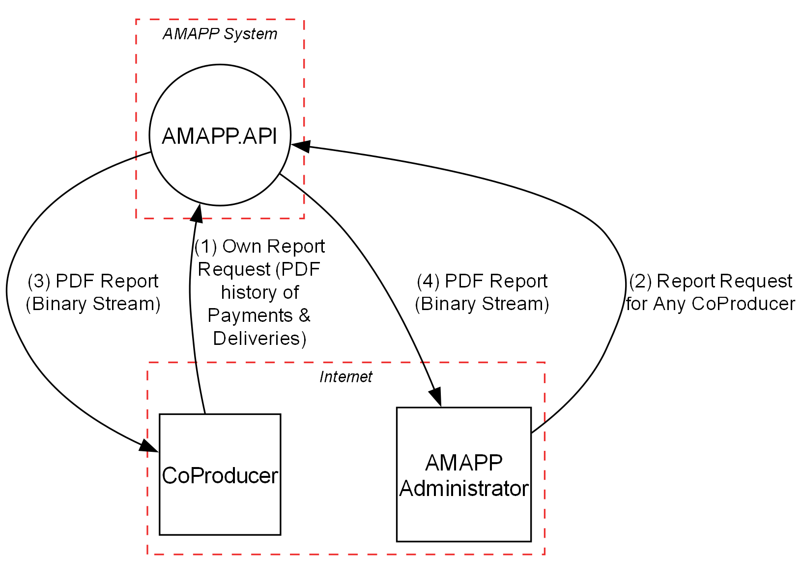
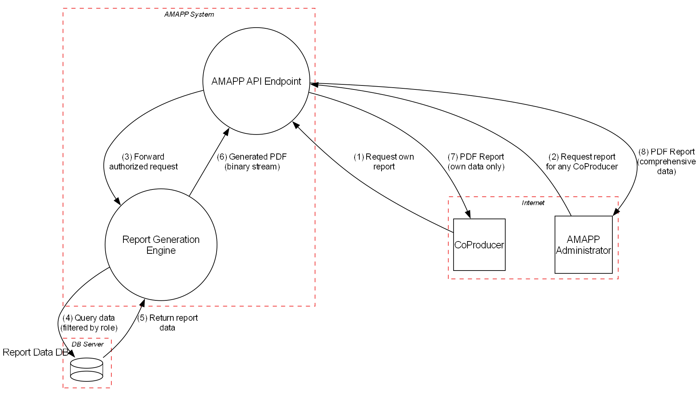

|  |  |
|:------------------------------:|:----------------------------------------------:|

# Phase 1: Threat Modeling  
**_Group desofs2025_mon_ffs_2_**  
*DESOFS*

**Master in Informatics Engineering - 2024/2025**

**Students:**  
Ilídio Magalhães - 1191577  
Hugo Coelho - 1162086  
Pedro Oliveira - 1240482  
Paulo Abreu - 1240481  
...  
**Location:** Porto, April 27, 2025

---

## Table of Contents

- [Phase 1: Threat Modeling](#phase-1-threat-modeling)
  - [Table of Contents](#table-of-contents)
  - [Introduction](#introduction)
  - [Project Analysis](#project-analysis)
    - [Project description](#project-description)
    - [Domain Model](#domain-model)
    - [Component Diagram](#component-diagram)
    - [Threat Model Information](#threat-model-information)
    - [Application Users](#application-users)
      - [Producer](#producer)
      - [Co-Producer (Consumer)](#co-producer-consumer)
      - [AMAP Administrators](#amap-administrators)
      - [System Admin](#system-admin)
      - [Non-Authenticated User](#non-authenticated-user)
      - [System](#system)
    - [Use Cases](#use-cases)
    - [Functional Requirements](#functional-requirements)
    - [Non-Functional Requirements](#non-functional-requirements)
    - [Security Requirements](#security-requirements)
    - [External Dependencies](#external-dependencies)
    - [Entry Points](#entry-points)
    - [Exit Points](#exit-points)
    - [Assets](#assets)
    - [Trust Levels](#trust-levels)
  - [Data Flow Diagrams](#data-flow-diagrams)
    - [Authentication](#authentication)
      - [Level 0](#level-0)
      - [Level 1](#level-1)
    - [Create Product](#create-product)
      - [Level 0](#level-0-1)
      - [Level 1](#level-1-1)
    - [Generic Representation](#generic-representation)
      - [Level 0](#level-0-2)
      - [Level 1](#level-1-2)
    - [Payments](#payments)
      - [Level 0](#level-0-3)
      - [Level 1](#level-1-3)
    - [Product Reservation](#product-reservation)
      - [Level 0](#level-0-4)
      - [Level 1](#level-1-4)
    - [Registration](#registration)
      - [Level 0](#level-0-5)
      - [Level 1](#level-1-5)
    - [User Management](#user-management)
      - [Level 0](#level-0-6)
      - [Level 1](#level-1-6)
  - [Stride](#stride)
    - [Authentication](#authentication-1)
    - [Create Product](#create-product-1)
    - [Generic Representation](#generic-representation-1)
    - [Payments](#payments-1)
    - [Product Reservation](#product-reservation-1)
    - [Registration](#registration-1)
    - [User Management](#user-management-1)
  - [Use Cases and Abuse Cases](#use-cases-and-abuse-cases)
    - [Authentication](#authentication-2)
    - [Create Product](#create-product-2)
    - [Payments](#payments-2)
    - [Product Reservation](#product-reservation-2)
    - [Registration](#registration-2)
    - [User Management](#user-management-2)
  - [Threat Classification](#threat-classification)
  - [Mitigations and Countermeasures](#mitigations-and-countermeasures)
  - [Threat Profile](#threat-profile)
  - [Conclusion](#conclusion)
  - [References](#references)

---

## Introduction

*_[Blablabla]_*

---

## Project Analysis

### Project description

*_[Blablabla]_*

---

### Domain Model

*_[Blablabla]_*

---

### Component Diagram

*_[Blablabla]_*

---

### Threat Model Information

*_[Blablabla]_*

---

### Application Users

#### Producer  
Responsible for the production and management of products available within the AMAP 
system, the producer is the main supplier in the community. Producers update the platform 
with information about product availability, production cycles, and inventory, which allows 
consumers to know exactly what is available each quarter. In addition, they ensure that 
production aligns with the orders placed beforehand, minimizing waste and maximizing 
sustainability. This user class has permissions to manage and adjust production data, keeping 
operations synchronized with consumer orders.

#### Co-Producer (Consumer) 
Also known as co-producers, consumers play an active role in AMAP’s sustainable model by 
ordering products directly from producers. These users engage in a long-term commitment, 
supporting local consumption and securing regular orders, typically on a quarterly basis. 
They have access to detailed information about the products, origin, and production 
practices, and can track order status up to delivery. Although they do not have permissions 
to modify production data, this user class can access product inquiry and ordering functions, 
along with resources that support sustainable consumption.

#### AMAP Administrators 
These users oversee the operational management of the system within AMAP. Acting as 
intermediaries between producers and consumers, they ensure data accuracy on the 
platform, address user issues or questions, and uphold AMAP’s values of sustainability and 
transparency. AMAP administrators have the authority to edit and review system content, 
facilitate updates or changes in practices, and ensure that digital operations align with 
organizational objectives. They also handle user support issues and facilitate communication 
among the different stakeholders.

#### System Admin 
With high-level permissions, the technical administrator is responsible for the overall 
configuration and maintenance of the system. They ensure the security, functionality, and 
stability of the platform, managing user permissions, updates, backups, and routine 
maintenance. This role is accountable for resolving complex issues and advanced settings, 
ensuring that the system runs efficiently, data is secure, and compliance and data protection 
practices are met.

#### Non-Authenticated User 
Representing new visitors or those interested in AMAP, these users can browse the 
system without needing to register. Access is limited to general information about AMAP, its 
mission, values, and available products. However, they cannot place orders or access data 
exclusive to authenticated users. This class enables visitors to learn more about AMAP’s 
purpose, encouraging engagement and fostering a path to becoming co-producers. 

#### System 
The System itself is responsible for sending automating notifications between users, 
such as notifying a Co-Producer that new product is available for delivery or is available or 
a payment date is due. 

---

### Use Cases

*_[Blablabla]_*

---

### Functional Requirements

*_[Blablabla]_*

---

### Non-Functional Requirements

*_[Blablabla]_*

---

### Security Requirements

*_[Blablabla]_*

...

### External Dependencies

*_[Blablabla]_*

...

### Entry Points

*_[Blablabla]_*

...

### Exit Points

*_[Blablabla]_*

### Assets

*_[Blablabla]_*

### Trust Levels

*_[Blablabla]_*

---

## Data Flow Diagrams

*_[Blablabla]_*

### Authentication

#### Level 0

*_[Blablabla]_*

#### Level 1

*_[Blablabla]_*

---

### Create Product

#### Level 0

*_[Blablabla]_*

#### Level 1

*_[Blablabla]_*

---

### Generic Representation

#### Level 0

The Level 0 Data Flow Diagram (DFD) provides a high-level overview of the AMAP/CSA agricultural system. This context diagram illustrates the core interactions between the system's main components and external entities.

At the center of the diagram is the AMAP API, which serves as the core processing unit handling all business logic and operations. The system interacts with three primary user types:

Consumers (Co-Producers) who browse products, place orders, and manage their subscriptions. The system responds by providing product information, order confirmations, and various notifications.

Producers who manage their product listings, update inventory, and process incoming orders. The system provides them with order notifications and delivery schedules.

AMAP Administrators who manage users, organize deliveries, and configure system settings. They receive system status updates, user data, and various reports.

All data persistence is handled through the external AMAP Database, where the API performs read and write operations for user data, orders, products, and inventory information. The database returns the requested data records to the API.

This Level 0 DFD effectively captures the fundamental data exchanges within the sustainable agriculture platform, showing how information flows between the system and its stakeholders without delving into the internal processing details.

#### Level 1

The Level 1 Data Flow Diagram (DFD) provides a more detailed view of the AMAP/CSA agricultural system architecture, expanding on the context diagram by revealing the internal components and their interactions.

The diagram is structured with nested boundaries:

Localhost serves as the outer boundary
AMAP System operates within the Localhost boundary
Database Server represents a separate boundary for data storage
Within the AMAP System boundary, two main components are identified:

AMAP API - The core processing component handling business logic, user authentication, and orchestrating the system's operations. It directly interfaces with all external actors and coordinates data operations.

AmapDB_API - A dedicated server component that serves as an intermediary layer between the main API and the database, providing abstraction and security for database operations.

Outside the system boundary, the AMAP Database exists as an external datastore where all system information is persistently stored.

The diagram illustrates several key data flows:

External Actor Communications: The three user types (Consumers, Producers, and Administrators) send API requests to and receive responses from the AMAP API.

Internal Data Processing: The AMAP API sends database requests to the AmapDB_API, which translates these into structured database queries.

Data Exchange: The database communication flow shows how CRUD operations are transformed into SQL queries, with result sets being returned and processed back into application-level data.

This Level 1 DFD demonstrates the system's layered architecture approach, with clear separation between the user interface logic, business processing, and data persistence layers. This architecture enhances security by ensuring database operations are properly abstracted and controlled through dedicated interfaces.

---

### Payments

#### Level 0

*_[Blablabla]_*

#### Level 1

*_[Blablabla]_*

---

### Product Reservation

#### Level 0

*_[Blablabla]_*

#### Level 1

*_[Blablabla]_*

---

### Registration

#### Level 0

*_[Blablabla]_*

#### Level 1

*_[Blablabla]_*

---

### User Management

#### Level 0

*_[Blablabla]_*

#### Level 1

*_[Blablabla]_*

---

## Stride

*_[Blablabla]_*

### Authentication

*_[Blablabla]_*

---

### Create Product

*_[Blablabla]_*

---

### Generic Representation

*_[Blablabla]_*

---

### Payments

*_[Blablabla]_*

---

### Product Reservation

*_[Blablabla]_*

---

### Registration

*_[Blablabla]_*

---

### User Management

*_[Blablabla]_*

---

## Use Cases and Abuse Cases

*_[Blablabla]_*

### Authentication

*_[Blablabla]_*

---

### Create Product

*_[Blablabla]_*

---

### Payments

*_[Blablabla]_*

---

### Product Reservation

*_[Blablabla]_*

---

### Registration

*_[Blablabla]_*

---

### User Management

*_[Blablabla]_*

---

## Threat Classification

*_[Blablabla]_*

---

## Mitigations and Countermeasures

*_[Blablabla]_*

---

## Threat Profile

*_[Blablabla]_*

---

## Conclusion

*_[Blablabla]_*

---

## References

*[Bibliographic references go here, in ACM-Reference-Format]*

