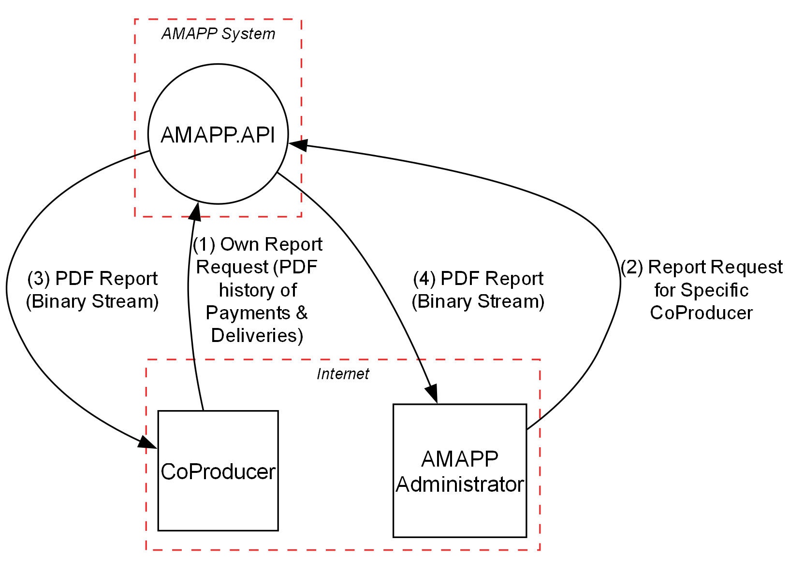
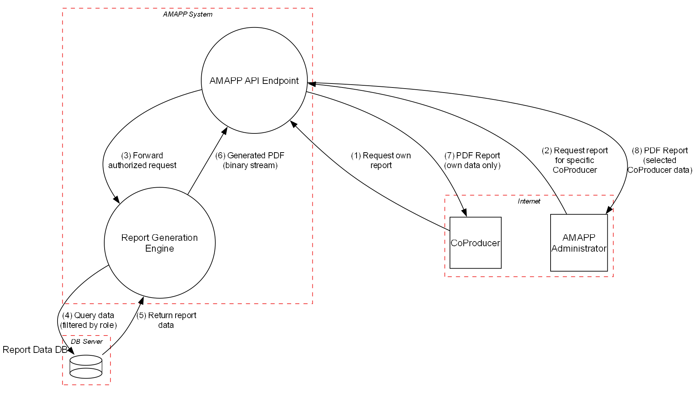

|  |  |
|:------------------------------:|:----------------------------------------------:|

# Phase 1: Threat Modeling  
**_Group desofs2025_mon_ffs_2_**  
*DESOFS*

**Master in Informatics Engineering - 2024/2025**

**Students:**  
Ilídio Magalhães - 1191577  
Hugo Coelho - 1162086  
Pedro Oliveira - 1240482  
Paulo Abreu - 1240481  
...  
**Location:** Porto, April 27, 2025

---

## Table of Contents

- [Phase 1: Threat Modeling](#phase-1-threat-modeling)
  - [Table of Contents](#table-of-contents)
  - [Introduction](#introduction)
  - [Project Analysis](#project-analysis)
    - [Project description](#project-description)
    - [Domain Model](#domain-model)
    - [Component Diagram](#component-diagram)
    - [Threat Model Information](#threat-model-information)
    - [Application Users](#application-users)
      - [Producer](#producer)
      - [Co-Producer (Consumer)](#co-producer-consumer)
      - [AMAP Administrators](#amap-administrators)
      - [System Admin](#system-admin)
      - [Non-Authenticated User](#non-authenticated-user)
      - [System](#system)
    - [Use Cases](#use-cases)
    - [Functional Requirements](#functional-requirements)
    - [Non-Functional Requirements](#non-functional-requirements)
    - [Security Requirements](#security-requirements)
    - [External Dependencies](#external-dependencies)
    - [Entry Points](#entry-points)
    - [Exit Points](#exit-points)
    - [Assets](#assets)
    - [Trust Levels](#trust-levels)
  - [Data Flow Diagrams](#data-flow-diagrams)
    - [Authentication](#authentication)
      - [Level 0](#level-0)
      - [Level 1](#level-1)
    - [Create Product](#create-product)
      - [Level 0](#level-0-1)
      - [Level 1](#level-1-1)
    - [Generic Representation](#generic-representation)
      - [Level 0](#level-0-2)
      - [Level 1](#level-1-2)
    - [Payments](#payments)
      - [Level 0](#level-0-3)
      - [Level 1](#level-1-3)
    - [Product Reservation](#product-reservation)
      - [Level 0](#level-0-4)
      - [Level 1](#level-1-4)
    - [Registration](#registration)
      - [Level 0](#level-0-5)
      - [Level 1](#level-1-5)
    - [User Management](#user-management)
      - [Level 0](#level-0-6)
      - [Level 1](#level-1-6)
  - [Stride](#stride)
    - [Authentication](#authentication-1)
    - [Create Product](#create-product-1)
    - [Generic Representation](#generic-representation-1)
    - [Payments](#payments-1)
    - [Product Reservation](#product-reservation-1)
    - [Registration](#registration-1)
    - [User Management](#user-management-1)
  - [Use Cases and Abuse Cases](#use-cases-and-abuse-cases)
    - [Authentication](#authentication-2)
    - [Create Product](#create-product-2)
    - [Payments](#payments-2)
    - [Product Reservation](#product-reservation-2)
    - [Registration](#registration-2)
    - [User Management](#user-management-2)
  - [Threat Classification](#threat-classification)
  - [Mitigations and Countermeasures](#mitigations-and-countermeasures)
  - [Threat Profile](#threat-profile)
  - [Conclusion](#conclusion)
  - [References](#references)

---

## Introduction

*_[Blablabla]_*

---

## Project Analysis

### Project description

*_[Blablabla]_*

---

### Domain Model

*_[Blablabla]_*

---

### Component Diagram

*_[Blablabla]_*

---

### Threat Model Information

*_[Blablabla]_*

---

### Application Users

#### Producer  
Responsible for the production and management of products available within the AMAP 
system, the producer is the main supplier in the community. Producers update the platform 
with information about product availability, production cycles, and inventory, which allows 
consumers to know exactly what is available each quarter. In addition, they ensure that 
production aligns with the orders placed beforehand, minimizing waste and maximizing 
sustainability. This user class has permissions to manage and adjust production data, keeping 
operations synchronized with consumer orders.

#### Co-Producer (Consumer) 
Also known as co-producers, consumers play an active role in AMAP’s sustainable model by 
ordering products directly from producers. These users engage in a long-term commitment, 
supporting local consumption and securing regular orders, typically on a quarterly basis. 
They have access to detailed information about the products, origin, and production 
practices, and can track order status up to delivery. Although they do not have permissions 
to modify production data, this user class can access product inquiry and ordering functions, 
along with resources that support sustainable consumption.

#### AMAP Administrators 
These users oversee the operational management of the system within AMAP. Acting as 
intermediaries between producers and consumers, they ensure data accuracy on the 
platform, address user issues or questions, and uphold AMAP’s values of sustainability and 
transparency. AMAP administrators have the authority to edit and review system content, 
facilitate updates or changes in practices, and ensure that digital operations align with 
organizational objectives. They also handle user support issues and facilitate communication 
among the different stakeholders.

#### System Admin 
With high-level permissions, the technical administrator is responsible for the overall 
configuration and maintenance of the system. They ensure the security, functionality, and 
stability of the platform, managing user permissions, updates, backups, and routine 
maintenance. This role is accountable for resolving complex issues and advanced settings, 
ensuring that the system runs efficiently, data is secure, and compliance and data protection 
practices are met.

#### Non-Authenticated User 
Representing new visitors or those interested in AMAP, these users can browse the 
system without needing to register. Access is limited to general information about AMAP, its 
mission, values, and available products. However, they cannot place orders or access data 
exclusive to authenticated users. This class enables visitors to learn more about AMAP’s 
purpose, encouraging engagement and fostering a path to becoming co-producers. 

#### System 
The System itself is responsible for sending automating notifications between users, 
such as notifying a Co-Producer that new product is available for delivery or is available or 
a payment date is due. 

---

### Use Cases

*_[Blablabla]_*

---

### Functional Requirements

*_[Blablabla]_*

---

### Non-Functional Requirements

*_[Blablabla]_*

---

### Security Requirements

*_[Blablabla]_*

...

### External Dependencies

*_[Blablabla]_*

...

### Entry Points

*_[Blablabla]_*

...

### Exit Points

*_[Blablabla]_*

### Assets

*_[Blablabla]_*

### Trust Levels

*_[Blablabla]_*

---

## Data Flow Diagrams

*_[Blablabla]_*

### Authentication

#### Level 0

*_[Blablabla]_*

#### Level 1

*_[Blablabla]_*

---

### Create Product

#### Level 0

The Level 0 DFD represents a high-level view of the product creation system, focusing on the interaction between the external actor (producer) and the AMAP API system.

- **External Actor:**
  - `Producer`: The user who intends to create a product.

- **Main Process:**
  - `AMAP API`: Interface responsible for receiving product creation requests, processing them, and returning feedback to the producer.

- **Data Flows:**
  - `Send Product Info`: The producer sends product data (name, description, price, etc.) to the API via HTTPS.
  - `Send Feedback`: After processing, the API returns a response (success, error, or validation messages) to the producer.

This diagram simply shows who interacts with the system and what data is exchanged, without yet detailing the internal processes.

#### Level 1

The Level 1 DFD deepens the details of the product creation process by breaking down the API into internal subprocesses and introducing data storage and trust boundaries.

- **External Actors:**
  - `Producer`: Remains the user who initiates the process.

- **Subprocesses:**
  - `Validate Input`: Validates the data received from the producer (checks required fields, formats, etc.).
  - `Store Product`: Stores the validated product in the database.
  - `Send Response`: Generates and sends a response with the operation result.

- **Data Storage:**
  - `Product DB`: The database where validated products are stored.

- **Data Flows:**
  - `Submit Product`: The producer sends product data for validation.
  - `Validated Data`: Verified data is passed to the storage process.
  - `Save to DB`: The product is saved into the database.
  - `Operation Outcome`: The result of the storage operation is passed to the response process.
  - `Return Result`: The response is sent back to the producer.

- **Trust Boundaries:**
  - `User Zone`: Where the producer resides (external environment).
  - `AMAP API Zone`: Where internal API processes occur.
  - `Database Zone`: Where the database resides, typically with stricter access controls.

This level shows in greater detail how the system processes and stores data, helping to identify potential security threats and ensure proper handling of information across different trust zones.

---

### Generic Representation

#### Level 0

The Level 0 Data Flow Diagram (DFD) provides a high-level overview of the AMAP/CSA agricultural system. This context diagram illustrates the core interactions between the system's main components and external entities.

At the center of the diagram is the AMAP API, which serves as the core processing unit handling all business logic and operations. The system interacts with three primary user types:

- Consumers (Co-Producers) who browse products, place orders, and manage their subscriptions. The system responds by providing product information, order confirmations, and various notifications.

- Producers who manage their product listings, update inventory, and process incoming orders. The system provides them with order notifications and delivery schedules.

- AMAP Administrators who manage users, organize deliveries, and configure system settings. They receive system status updates, user data, and various reports.

All data persistence is handled through the external AMAP Database, where the API performs read and write operations for user data, orders, products, and inventory information. The database returns the requested data records to the API.

This Level 0 DFD effectively captures the fundamental data exchanges within the sustainable agriculture platform, showing how information flows between the system and its stakeholders without delving into the internal processing details.

#### Level 1

The Level 1 Data Flow Diagram (DFD) provides a more detailed view of the AMAP/CSA agricultural system architecture, expanding on the context diagram by revealing the internal components and their interactions.

The diagram is structured with nested boundaries:

Localhost serves as the outer boundary
AMAP System operates within the Localhost boundary
Database Server represents a separate boundary for data storage
Within the AMAP System boundary, two main components are identified:

- AMAP API - The core processing component handling business logic, user authentication, and orchestrating the system's operations. It directly interfaces with all external actors and coordinates data operations.

- AmapDB_API - A dedicated server component that serves as an intermediary layer between the main API and the database, providing abstraction and security for database operations.

Outside the system boundary, the AMAP Database exists as an external datastore where all system information is persistently stored.

The diagram illustrates several key data flows:

- External Actor Communications: The three user types (Consumers, Producers, and Administrators) send API requests to and receive responses from the AMAP API.

- Internal Data Processing: The AMAP API sends database requests to the AmapDB_API, which translates these into structured database queries.

- Data Exchange: The database communication flow shows how CRUD operations are transformed into SQL queries, with result sets being returned and processed back into application-level data.

This Level 1 DFD demonstrates the system's layered architecture approach, with clear separation between the user interface logic, business processing, and data persistence layers. This architecture enhances security by ensuring database operations are properly abstracted and controlled through dedicated interfaces.

---

### Payments

#### Level 0

*_[Blablabla]_*

#### Level 1

*_[Blablabla]_*

---

### Product Reservation

#### Level 0

The Level 0 Data Flow Diagram (DFD) for the AMAP/CSA product purchase flow provides a high-level overview of how consumers interact with the system to browse and reserve agricultural products.

This simplified context diagram focuses specifically on the purchase/reservation process from the consumer perspective. At its core is the AMAP API, which serves as the central processing component that handles all product purchase operations. Unlike the general system overview, this diagram isolates the specific functionality related to product transactions.

The diagram shows a single external actor, the Consumer (Co-Producer), who interacts with the system to browse available products and place orders. This focused view highlights the consumer's journey through the purchase process without the complexity of other system interactions.

The data flows are presented in a logical sequence that follows the typical purchase process:

The consumer initiates the process by sending a Purchase Request to the system, which includes product selections, order details, and payment information.

The AMAP API communicates with the external AMAP Database through Data Operations to store and retrieve purchase-related data, including product queries, order storage, and inventory updates.

The database responds with Data Results containing product data, order confirmations, and current inventory status.

Finally, the AMAP API sends a Purchase Response back to the consumer with product listings, order confirmations, and payment receipts.

This Level 0 DFD effectively captures the fundamental flow of the purchase process, showing how information moves between the consumer, the system, and the database in a complete transaction cycle. This representation allows stakeholders to understand the high-level purchase flow without being overwhelmed by implementation details.

#### Level 1

The Level 1 Data Flow Diagram (DFD) for the AMAP/CSA product reservation process provides a detailed view of the system components involved in the consumer product reservation journey. Unlike the Level 0 diagram which presented a high-level overview, this diagram breaks down the internal processes and data flows that facilitate the reservation experience.

The diagram defines two main boundaries:

AMAP System containing the application processes
Database Server containing the data persistence layer
Within the AMAP System boundary, four distinct processes work together to handle the product reservation workflow:

- Product Catalog - Manages product listings and inventory information, serving as the entry point for consumers browsing available products.

- Order Management - Handles order creation and processing, coordinating the overall reservation workflow.

- Reservation Processing - Specifically manages product reservation requests, ensuring products are properly reserved for consumers.

- Delivery Management - Handles product delivery coordination after reservation.

The diagram shows a single external actor, the Co-Producer (consumer), who interacts with the system to browse products and make reservations.

The data flows illustrate a comprehensive reservation process:

The consumer begins by browsing products, with product information flowing from the catalog.
Once products are selected, the consumer places an order that is processed by Order Management.
Order Management checks product availability through the Product Catalog.
The reservation is processed by the Reservation Processing component.
Delivery details are managed by the Delivery Management component.
Throughout the process, data is stored and retrieved from the external AMAP Database.
This Level 1 DFD reveals how the system's modular architecture separates concerns into distinct processing components, each handling a specific part of the reservation workflow. The diagram shows not only the consumer-facing interactions but also the important internal communications between components that ensure the reservation process functions correctly.

By breaking down the process into these components, the system achieves better maintainability and security through separation of responsibilities while providing a seamless experience for consumers reserving agricultural products.

---

### Registration

#### Level 0

*_[Blablabla]_*

#### Level 1

*_[Blablabla]_*

---

### User Management

#### Level 0

*_[Blablabla]_*

#### Level 1

*_[Blablabla]_*

---

## Stride

STRIDE is a threat modeling methodology used to categorize and analyze security threats in software systems. It helps identify potential vulnerabilities by classifying them into six main categories, each representing a specific type of threat.

The STRIDE acronym stands for:

- **S – Spoofing**: When an attacker pretends to be another entity (e.g., credential theft or impersonation).
- **T – Tampering**: Unauthorized modification of data or system components.
- **R – Repudiation**: Performing actions that cannot be traced or proven, allowing users to deny their actions without accountability.
- **I – Information Disclosure**: Exposure of sensitive information to unauthorized entities.
- **D – Denial of Service (DoS)**: Making a system or service unavailable to legitimate users by overwhelming or disrupting it.
- **E – Elevation of Privilege**: Gaining higher access rights than initially authorized, often used to escalate attacks.

### Authentication

*_[Blablabla]_*

---

### Create Product

The most relevant potential threats identified in the document [amapp_dfd_create_product_report.md](diagrams/DFD/Create%20Product/amapp_dfd_create_product_report.md), generated from the Level 1 DFD of the product creation process, were selected based on their significance and potential impact. The STRIDE methodology was then applied to these threats to support the analysis and categorization of risks associated with the system.

To select the most important threats listed in the report, the following criteria were used:

1. **High or Critical Severity**: Threats with the greatest potential impact on the system.
2. **Critical Target**: Threats affecting essential components such as input validation, data storage, or communication.
3. **Likelihood of Exploitation**: Threats that are more common or easier to exploit.
4. **Business Impact**: Threats that could compromise sensitive data, cause service disruption, or damage the organization's reputation.

| **Threat**                                   | **Targeted Element**                          | **STRIDE Category**         | **Description**                                                                                                                                                                                                                     | **Mitigation**                                                                                                                                                                                                                                                                                                                                                   |
|---------------------------------------------|-----------------------------------------------|------------------------------|-------------------------------------------------------------------------------------------------------------------------------------------------------------------------------------------------------------------------------------|----------------------------------------------------------------------------------------------------------------------------------------------------------------------------------------------------------------------------------------------------------------------------------------------------------------------------------------------------------------|
| **INP02 - Overflow Buffers**                | Validate Input, Store Product, Send Response  | Tampering                   | Buffer overflow é uma vulnerabilidade crítica que pode levar à execução de código arbitrário, comprometendo todo o sistema. Como afeta a validação de entrada e o armazenamento, é uma ameaça prioritária.                          | Use languages or compilers that perform automatic bounds checking. Utilize secure functions and static analysis tools to identify vulnerabilities.                                                                                                                                                                                                              |
| **INP07 - Buffer Manipulation**             | Validate Input, Store Product, Send Response  | Tampering                   | Manipulação de buffer pode ser explorada para corromper dados ou executar código malicioso. É uma ameaça comum em sistemas que lidam com buffers de dados.                                                                           | Use secure coding practices to prevent buffer manipulation. Validate input sizes and use tools to detect vulnerabilities.                                                                                                                                                                                                                                        |
| **AC21 - Cross-Site Request Forgery (CSRF)** | Send Response                                 | Spoofing                    | CSRF pode permitir que um atacante realize ações maliciosas em nome de um usuário autenticado, comprometendo a integridade do sistema e a confiança do usuário.                                                                     | Use cryptographic tokens to associate requests with specific actions. Validate HTTP Referrer headers and implement multi-factor authentication for sensitive actions.                                                                                                                                                                                             |
| **INP23 - File Content Injection**          | Store Product, Send Response                  | Tampering                   | A injeção de conteúdo em arquivos pode levar à execução de código remoto, comprometendo o servidor e os dados armazenados.                                                                                                          | Validate all input, including files. Place accepted files in a sandbox environment. Use host integrity monitoring and antivirus scanning.                                                                                                                                                                                                                       |
| **CR06 - Communication Channel Manipulation** | Submit Product, Validated Data, Save to DB, Return Result | Information Disclosure      | Manipulação de canais de comunicação pode expor dados sensíveis, como credenciais e informações confidenciais, além de permitir ataques como MITM (Man-in-the-Middle).                                                              | Encrypt all sensitive communications using properly configured cryptography. Associate authentication/authorization with each channel/message.                                                                                                                                                                                                                   |
| **AC12 - Privilege Escalation**             | Store Product, Send Response                  | Elevation of Privilege      | Escalação de privilégios pode permitir que um atacante obtenha controle total do sistema, comprometendo todos os dados e operações.                                                                                                | Carefully manage privileges and follow the principle of least privilege. Implement privilege separation and require multiple conditions for accessing sensitive resources.                                                                                                                                                                                        |
| **INP08 - Format String Injection**         | Store Product, Send Response                  | Tampering                   | Injeção de strings de formato pode ser usada para acessar ou modificar dados sensíveis, além de causar falhas no sistema.                                                                                                           | Limit the use of string formatting functions. Validate and filter user input for illegal formatting characters.                                                                                                                                                                                                                                                  |
| **DE04 - Audit Log Manipulation**           | Product DB                                    | Repudiation                 | Manipulação de logs pode ocultar atividades maliciosas, dificultando a detecção de ataques e comprometendo a integridade do sistema.                                                                                                | Follow the principle of least privilege to prevent unauthorized access to logs. Validate input before writing to logs and avoid tools that interpret control characters.                                                                                                                                                                                          |

---

### Generic Representation

*_[Blablabla]_*

---

### Payments

*_[Blablabla]_*

---

### Product Reservation

*_[Blablabla]_*

---

### Registration

*_[Blablabla]_*

---

### User Management

*_[Blablabla]_*

---

## Use Cases and Abuse Cases

*_[Blablabla]_*

### Authentication

*_[Blablabla]_*

---

### Create Product

This diagram represents a security-focused approach using both **Use Cases** and **Abuse Cases** within the product creation process. The main goal is to identify potential threats to the system and link them with appropriate countermeasures.

#### **Use Cases**

- **Submit Product**  
  The producer submits new product data through the API. This is the starting point of the product creation process.

- **Validate Input**  
  The submitted data is validated for structure, format, and required fields. This ensures data quality and integrity before persistence.

- **Store Product**  
  After successful validation, the product data is saved to the database.

- **Send Response**  
  The system sends a response to the producer, indicating success or failure, including validation or error messages.

#### **Abuse Cases**

- **Submit Malicious Product Data**  
  An attacker attempts to send malicious content (e.g., scripts or SQL commands) disguised as product data.

- **Exploit Validation Loopholes**  
  The attacker exploits weaknesses or omissions in the validation logic to inject invalid or harmful data.

- **Inject Malicious Code into Product Data**  
  Product fields are manipulated with malicious code (e.g., XSS or SQL injection), taking advantage of weak validation.

- **Tamper with Stored Product Data**  
  The attacker tries to directly alter stored data, compromising the integrity of the database.

- **Flood API with Product Submissions**  
  A denial-of-service (DoS) attack where the attacker continuously submits product creation requests to overload the system.

#### **Countermeasures**

- **Input Validation and Sanitization**  
  Protects against malicious input by validating and sanitizing all fields. Mitigates abuse cases AC1 and AC2.

- **Rate Limiting and Throttling**  
  Limits the number of requests allowed per user over time, preventing system overload. Mitigates AC5.

- **Secure Coding Practices**  
  Involves practices like avoiding `eval`, using parameterized queries, and applying strict input validation. Mitigates AC3.

- **Database Access Controls**  
  Restricts direct access and enforces permission controls on the database, preventing unauthorized modifications. Mitigates AC4.

- **Monitoring and Alerts**  
  Continuous monitoring to detect abnormal behavior and trigger automated alerts. Acts as a monitoring measure for AC5.

This model provides a clear foundation for threat analysis, illustrating how the system could be exploited and what preventive measures are in place.

---

### Payments

*_[Blablabla]_*

---

### Product Reservation

*_[Blablabla]_*

---

### Registration

*_[Blablabla]_*

---

### User Management

*_[Blablabla]_*

---

## Threat Classification

*_[Blablabla]_*

---

## Mitigations and Countermeasures

*_[Blablabla]_*

---

## Threat Profile

*_[Blablabla]_*

---

## Conclusion

*_[Blablabla]_*

---

## References

*[Bibliographic references go here, in ACM-Reference-Format]*

