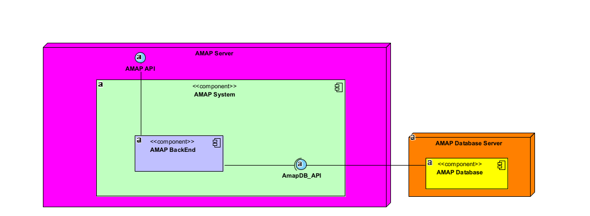
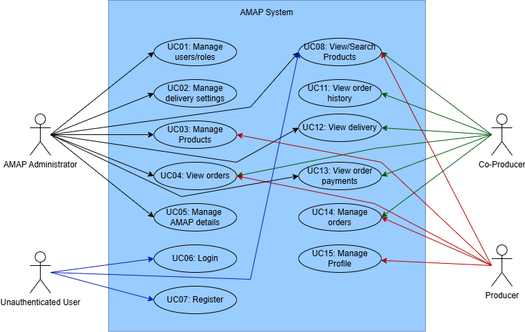

|  |  |
| :-----------------------------: | :---------------------------------------------: |

#  Phase 2: Sprint 1

**_Group desofs2025_mon_ffs_2_**
*DESOFS*

**Master in Informatics Engineering - 2024/2025**

**Students:**
Ilídio Magalhães - 1191577  
Hugo Coelho - 1162086  
Pedro Oliveira - 1240482  
Paulo Abreu - 1240481  

**Location:** Porto, May 26, 2025

---

## Table of Contents

- [Introduction](#introduction)
- [Project Analysis](#project-analysis)
  - [Project description](#project-description)
  - [Domain Model](#domain-model)
  - [Component Diagram](#component-diagram)
  - [Logical Diagram ??](#logical-diagram-)
  - [Application Users](#application-users)
    - [Producer](#producer)
    - [Co-Producer](#co-producer)
    - [AMAP Administrators](#amap-administrators)
  - [Use Cases](#use-cases)
  - [Functional Requirements](#functional-requirements)
  - [Non-Functional Requirements](#non-functional-requirements)
  - [Security Requirements](#security-requirements)
  - [Secure Development Requirements](#secure-development-requirements)
- [Risk Assessment](#risk-assessment)
  - [Risk Register](#risk-register)
- [Conclusion](#conclusion)

---

## Introduction

Blablabla 

---

## Project Analysis

### Project description

Blablabla

---

### Domain Model

Para enquadrar.
Mantivemos a estrutura do Domain Model.

This class diagram represents the **core data structure** of the AMAPP platform, outlining the main entities involved in the management of orders between co-producers and producers.

- The base class `User` is extended by three user types: `Producer`, `AMAPAdministrator`, and `CoProducer`, each with specific roles.
- Producers can **create products**, which are tracked in an associated `Inventory` component.
- Co-producers can **place orders** (`Order`), which consist of multiple `OrderItem` elements, each linked to a specific product.
- Orders can be linked to **payments** and **deliveries**, managed by the `Payment` and `Delivery` classes respectively.
- The `AMAPAdministrator` manages delivery dates and logistics.
- Inventory updates are reflected based on `OrderItem` activity.

---

### Component Diagram

Alterar diagrama e explicar.

Blablabla

---

### Logical Diagram ??

Alterar diagrama e explicar.

Blablabla

---

### Application Users

Para enquadrar.
Mantivemos a estrutura do Domain Model.

#### Producer

Responsible for the production and management of products available within the AMAP system, the producer is the main supplier in the community. Producers update the platform with information about product availability, production cycles, and inventory, which allows consumers to know exactly what is available each quarter. In addition, they ensure that production aligns with the orders placed beforehand, minimizing waste and maximizing sustainability. This user class has permissions to manage and adjust production data, keeping operations synchronized with consumer orders.

#### Co-Producer

Also known as co-producers, consumers play an active role in AMAP's sustainable model by ordering products directly from producers. These users engage in a long-term commitment, supporting local consumption and securing regular orders, typically on a quarterly basis. They have access to detailed information about the products, origin, and production practices, and can track order status up to delivery. Although they do not have permissions to modify production data, this user class can access product inquiry and ordering functions, along with resources that support sustainable consumption.

#### AMAP Administrators

These users oversee the operational management of the system within AMAP. Acting as intermediaries between producers and consumers, they ensure data accuracy on the platform, address user issues or questions, and uphold AMAP’s values of sustainability and transparency. AMAP administrators have the authority to edit and review system content, facilitate updates or changes in practices, and ensure that digital operations align with organizational objectives. They also handle user support issues and facilitate communication among the different stakeholders.

---

### Use Cases

Alterar diagrama e explicar.

Blablabla

---

### Functional Requirements

Fazer alterações se necessário.

Blablabla

#### UC01 - Manage Users/Roles

- **REQ-01**: Add a role to a user.
- **REQ-02**: Change user role.
- **REQ-03**: View current role configurations.
- **REQ-04**: Modify criteria and role permissions.

#### UC02 - Manage Delivery Settings

- **REQ-05**: Create the delivery settings.
- **REQ-06**: Update the delivery settings.

#### UC03 - Manage Products

- **REQ-07**: Add new products to the catalog.
- **REQ-08**: Update existing product information.
- **REQ-09**: Deactivate products from the catalog.

#### UC04 - View Orders

- **REQ-10**: Display all active and completed orders.
- **REQ-11**: Provide detailed information for each order.
- **REQ-12**: Allow filtering and sorting orders by date, status, product, co-producer or producer.
- **REQ-13**: Provide detailed information for each order.

#### UC05 - Manage AMAP Details

- **REQ-14**: View current AMAP information.
- **REQ-15**: Update location details and contact information.

#### UC06 - Login

- **REQ-16**: Authenticate users based on entered credentials and role privileges.
- **REQ-17**: Recover user account password via a recovery link or code sent to a registered email or phone number.

#### UC07 - Register

- **REQ-18**: Create a new user account.

#### UC08 - View/Search Products

- **REQ-19**: View list of products from the AMAP, with filtering options for product type, producer, and availability.
- **REQ-20**: View detailed information about a product, including information about the producer, type, and availability.

#### UC09 - Manage Orders

- **REQ-21**: Co-producer can make new order.
- **REQ-22**: Co-producer can see the details of their orders.
- **REQ-23**: Co-producer can update their orders.
- **REQ-24**: Producer can see the list of orders for their products.
- **REQ-25**: Producer can update orders that contain their products.

#### UC10 - View Order History

- **REQ-26**: Provides access to a comprehensive history of all past orders within the AMAP, including key details such as requested products and order status. It also allows the actor to filter the history by parameters like product, date, or status to easily locate specific orders.

#### UC11 - View Delivery

- **REQ-27**: Access detailed information about scheduled deliveries, including date, address, and delivered products, and can filter deliveries by criteria such as date or delivery status.
- **REQ-28**: View detailed information about the status of each delivery, such as "pending", "in progress", or "completed".

#### UC12 - View Order Payments

- **REQ-29**: Co-producer has access to the history of all payments made within the system, displaying relevant details such as date, amount paid, and payment status, and allow filtering of the payment history by date, amount, and payment status.
- **REQ-30**: AMAP Admin can access the payment history of each co-producer.

#### UC13 - Manage Profile

- **REQ-31**: The actor is capable of viewing and editing profile details, including address, contact information, and other personal data.
- **REQ-32**: The actor can upload important documents, such as organic certification or other credentials, to verify their qualifications.

---

### Non-Functional Requirements

Fazer alterações se necessário.

Blablabla

#### 1. Performance

- The system must respond to user requests in under 1 second under normal operating conditions.
- The API must be capable of processing at least 100 requests per second in a production environment, ensuring low latency and high throughput.
- Page load times in the frontend should not exceed 2 seconds in 95% of accesses.

#### 2. Availability

- The application must be available to users 24/7, except during scheduled maintenance periods.
- The infrastructure must ensure **fault tolerance**, maintaining functionality of at least one critical component (API, database, frontend) in case of partial failure.
- The system must achieve a **minimum availability of 99%** during regular operating hours (08:00–22:00).

#### 3. Scalability

- The system architecture must support **horizontal scalability**, allowing backend services to run in multiple instances.
- The system must handle up to **3 times the average number of active users** without noticeable performance degradation.
- Storage and processing capacity should be adjustable dynamically according to demand.

#### 4. Security

- All communication between client and server must be encrypted via **HTTPS/TLS**.
- Authentication must be implemented using **secure, expiring tokens (e.g., JWT)**, with support for refresh tokens.
- The system must enforce **role-based access control** (e.g., AMAP manager, producer, co-producer).
- Measures must be in place to protect against common attacks such as **SQL Injection, XSS, CSRF, and brute-force login attempts**.
- Passwords must be securely stored using strong hashing algorithms (e.g., bcrypt or Argon2).

#### 5. Reliability and Integrity

- Critical operations (e.g., orders and payments) must guarantee **persistence and atomicity**, even in the event of partial failures.
- There must be **error and event logging** for **auditability** and recovery.
- The system must follow the **ACID principle** for relational database operations, and eventual consistency for MongoDB operations.

#### 6. Maintainability

- The code must follow **software engineering best practices**, such as separation of concerns, design patterns, and documentation.
- The system must allow for **modular updates**, enabling new features to be added without requiring full downtime.
- There should be **test coverage above 80%** for critical features, including unit, integration, and acceptance tests.

#### 7. Portability

- The application must be **compatible with Linux environments**, preferably via **Docker containers** orchestrated with **Kubernetes**.
- The API must follow **RESTful standards**, enabling future integration with other systems and external services.
- The system should be easily deployable in both local and cloud environments.

#### 8. Monitoring and Alerts

- The system must expose **technical metrics** (CPU, memory, latency, throughput, etc.) compatible with tools like **Prometheus and Grafana**.
- There must be **automatic alerts** for critical errors, service failures, or performance degradation, ensuring rapid response to incidents.
- Logs must be centralized and analyzable with tools such as the **ELK Stack** or **Grafana Loki**.

---

### Security Requirements

Fazer alterações se necessário.
Verificar se faz sentido manter.

Blablabla

#### Functional Security Requirements (CIA-Based)

Fazer alterações se necessário.

##### Confidentiality

- FS01: The system must authenticate all users (OAuth 2.0, JWT).
- FS02: The system must enforce role-based access control (RBAC).
- FS03: All communication must use HTTPS/TLS.
- FS04: Sensitive data must be encrypted in transit and at rest.
- FS05: Authentication tokens must be unique per session and revocable.

##### Integrity

- FS06: All input must be validated and sanitized (whitelisting, type, size).
- FS07: Protection against injection attacks (SQL, XML, LDAP, etc.).
- FS08: Audit logs must be tamper-proof and protected from modification.
- FS09: Error messages must not expose internal system details.

##### Availability

- FS10: The system must implement rate limiting and DoS protections (flooding, resource exhaustion).
- FS11: Regular, automated backups must be supported and tested.
- FS12: The system must support high availability (clustering, replication).

#### Non-Functional Security Requirements

Fazer alterações se necessário.

- NFS01: System uptime must be ≥ 99.5% under load.
- NFS02: The system must scale horizontally without compromising security.
- NFS03: Audit logs must ensure integrity via hashing or signing.
- NFS04: Real-time anomaly detection and alerting must be in place.
- NFS05: Incident response time must be ≤ 2 hours.
- NFS06: MFA must not degrade system performance by more than 15%.
- NFS07: Backup recovery must take no longer than 30 minutes.
- NFS08: Incident response procedures must be documented.
- NFS09: Logs must be protected and retained for at least one year.

---

### Secure Development Requirements

Verificar se faz sentido manter.

Blablabla

#### 1. Secure Coding Guidelines

- Follow recognized standards such as [OWASP Secure Coding Practices](https://owasp.org/www-project-secure-coding-practices-quick-reference-guide/), CERT Secure Coding Standards, or Microsoft's Secure Coding Guidelines.
- Apply best practices:
  - Strict input validation.
  - Strong authentication and secure session management.
  - Proper use of cryptography.
  - Secure error and exception handling (e.g., no stack trace exposure).
  - Principle of least privilege.

#### 2. Dependency Management

- Monitor third-party libraries and frameworks.
- Quickly update vulnerable dependencies.
- Avoid using unmaintained or suspicious packages.

#### 3. Secure Code Review

- Perform security-focused code reviews for all new code and major changes.
- Use automated tools (e.g., SonarQube) to assist but not replace manual review.
- Focus areas:
  - Critical components like authentication, authorization, and data access.
  - Common vulnerability patterns (SQL Injection, XSS, CSRF, etc.).
  - Business logic errors that could be exploited.

#### 4. Static Application Security Testing (SAST)

- Use static code analysis tools (e.g., SonarQube) integrated in CI/CD pipelines to detect vulnerabilities early.

#### 5. Secure Build and Deployment

- Ensure builds are automated, reproducible, and conducted in controlled environments.
- Prevent secret exposure (keys, passwords) in repositories or pipelines.

#### 6. Logging and Monitoring

- Implement secure logging of security-relevant events (e.g., logins, unauthorized access attempts, critical errors).
- Ensure logs do not contain sensitive information (e.g., passwords, credit card numbers).

#### 7. Development of Automated Security Tests

- Create and maintain automated security tests as part of the development lifecycle.
- Integrate security tests into the CI/CD pipeline to continuously validate code security.
- Cover common vulnerabilities such as injection flaws, authentication issues, and access control weaknesses.
- Include unit tests focused on validating security-related functions.
- Implement integration tests to verify secure interactions between different components.
- Develop end-to-end tests to simulate real-world security scenarios and verify protection mechanisms.

---

## Risk Assessment

Threats mais importantes, importante referir quais foram implementadas no sprint1.
Salientar se verificarmos se que algum nao vai ser implementado.

Blablabla

1. **Threat Identification**
   We begin with the STRIDE-based threat model, which enumerates potential attacks across Spoofing, Tampering, Repudiation, Information Disclosure, Denial of Service, and Elevation of Privilege.
2. **Scoring Criteria**Each threat is evaluated on four dimensions:

   - `Severity`: potential damage if exploited (1–5)
   - `Asset Criticality`: importance of the targeted component (1–5)
   - `Likelihood`: probability of successful exploitation given existing controls (1–5)
   - `Business Impact`: financial, operational, reputational, or regulatory consequences (1–5)
3. **Risk Calculation**
   We compute the **Risk Score** as:  Risk Score = Likelihood × ((Severity + Asset Criticality) ÷ 2)
4. **Risk Prioritization**

- `High`: Risk Score ≥ 15
- `Medium`: 8 ≤ Risk Score < 15
- `Low`: Risk Score < 8

### Risk Register

| Threat                      | Category           | Likelihood | Severity | Asset Criticality | Impact (avg) | Risk Score | Priority |
| --------------------------- | ------------------ | ---------- | -------- | ----------------- | ------------ | ---------- | -------- |
| Authentication Bypass       | Spoofing           | 4          | 5        | 5                 | 5.0          | 20.0       | High     |
| Password Brute Force        | Denial of Service  | 5          | 4        | 3                 | 3.5          | 17.5       | High     |
| Authentication Abuse/Bypass | Spoofing           | 3          | 4        | 4                 | 4.0          | 12.0       | Medium   |
| Buffer Overflow             | Tampering          | 3          | 4        | 4                 | 4.0          | 12.0       | Medium   |
| Session Hijacking           | Spoofing           | 3          | 4        | 4                 | 4.0          | 12.0       | Medium   |
| Cross-Site Request Forgery  | Spoofing/Tampering | 3          | 3        | 3                 | 3.0          | 9.0        | Medium   |
| Fake Registration           | Spoofing           | 3          | 3        | 3                 | 3.0          | 9.0        | Medium   |
| Admin Impersonation         | Spoofing           | 2          | 4        | 4                 | 4.0          | 8.0        | Medium   |

> **Comment:**We averaged **Severity** and **Asset Criticality** to derive **Impact**, then multiplied by **Likelihood**.
>
> - Two **High**-priority threats (Authentication Bypass and Password Brute Force) exceed 15, indicating immediate focus on strong MFA, rate-limiting, and token validation.
> - The remaining **Medium**-priority threats (scores 8–12) cover authorization weaknesses, buffer issues, and CSRF
> - No threats currently fall into **Low**, but periodic review may reclassify them as controls mature.

---

## Development

Blablabla

### Technology Used

Blablabla

### Structure

Blablabla

### Subdividir pelos pontos a baixo: 

Developed enough functionality to showcase automation.
Documented set of development best practices adopted.
Evidence of security audits, code reviews, static code
analysis, software composition analysis, and other relevant
practices.

---

## Build and Test

Blablabla

### Subdividir pelos pontos a baixo: 

Inventory of components, execution of test plans, dynamic
analysis, conguration validation, artifact scanning, and
other relevant practices.

---

## Pipeline automation

Blablabla

### Subdividir pelos pontos a baixo: 

Most practices are automated.

---

## ASVS

Blablabla

### Subdividir pelos pontos a baixo: 

Completeness of ASVS assessment; Tracebility between
documented security requirements and tests.

---

## Conclusion

Blablabla

---
