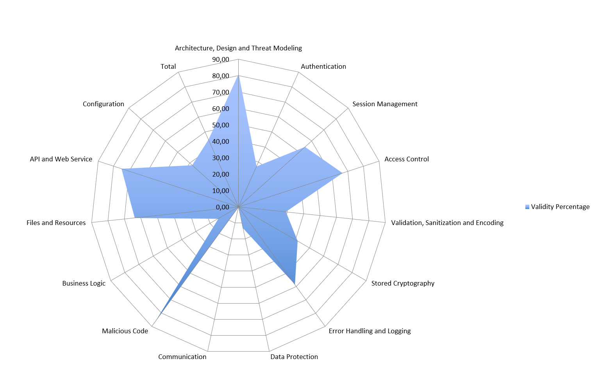
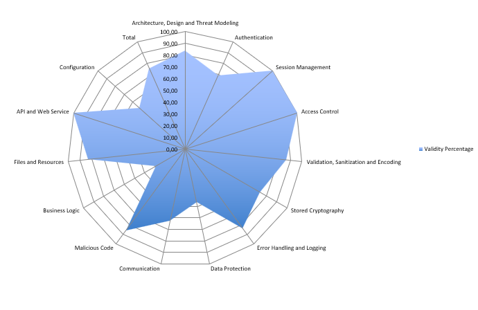

|  |  |
| :-----------------------------: | :---------------------------------------------: |

#  Phase 2: Sprint 2

**_Group desofs2025_mon_ffs_2_**
*DESOFS*

**Master in Informatics Engineering - 2024/2025**

**Students:**
Ilídio Magalhães - 1191577  
Hugo Coelho - 1162086  
Pedro Oliveira - 1240482  
Paulo Abreu - 1240481  

**Location:** Porto, May 26, 2025

---

## Table of Contents

- [Phase 2: Sprint 1](#phase-2-sprint-1)
  - [Table of Contents](#table-of-contents)
  - [Introduction](#introduction)
    - [Objectives](#objectives)
    - [Scope](#scope)
  - [Project Analysis](#project-analysis)
    - [Project description](#project-description)
    - [Domain Model](#domain-model)
    - [Component Diagram](#component-diagram)
    - [Application Users](#application-users)
      - [Producer](#producer)
      - [Co-Producer](#co-producer)
      - [AMAP Administrators](#amap-administrators)
    - [Use Cases](#use-cases)
    - [Functional Requirements](#functional-requirements)
      - [UC01 - Manage Users/Roles](#uc01---manage-usersroles)
      - [UC02 - Manage Delivery Settings](#uc02---manage-delivery-settings)
      - [UC03 - Manage Products](#uc03---manage-products)
      - [UC04 - Manage AMAP Details](#uc04---manage-amap-details)
      - [UC05 - Login](#uc05---login)
      - [UC06 - Register](#uc06---register)
      - [UC07 - View/Search Products](#uc07---viewsearch-products)
      - [UC08 - View Order History](#uc08---view-order-history)
      - [UC09 - View Delivery](#uc09---view-delivery)
      - [UC10 - View Orders](#uc10---view-orders)
      - [UC11 - Manage Orders](#uc11---manage-orders)
      - [UC12 - Manage Profile](#uc12---manage-profile)
    - [Non-Functional Requirements](#non-functional-requirements)
      - [1. Performance](#1-performance)
      - [2. Availability](#2-availability)
      - [3. Scalability](#3-scalability)
      - [4. Security](#4-security)
      - [5. Reliability and Integrity](#5-reliability-and-integrity)
      - [6. Maintainability](#6-maintainability)
      - [7. Portability](#7-portability)
      - [8. Monitoring and Alerts](#8-monitoring-and-alerts)
    - [Security Requirements](#security-requirements)
      - [Functional Security Requirements (CIA-Based)](#functional-security-requirements-cia-based)
        - [Confidentiality](#confidentiality)
        - [Integrity](#integrity)
        - [Availability](#availability)
      - [Non-Functional Security Requirements](#non-functional-security-requirements)
  - [Risk Assessment](#risk-assessment)
    - [Risk Register](#risk-register)
  - [Development](#development)
    - [Technology Used](#technology-used)
    - [Structure](#structure)
  - [Pipeline](#pipeline)
    - [Job 1: Code Analysis (SAST with CodeQL)](#job-1-code-analysis-sast-with-codeql)
      - [Job Setup and Configuration](#job-setup-and-configuration)
      - [Job Execution Steps](#job-execution-steps)
    - [Job 2: Build and Test](#job-2-build-and-test)
      - [Job Setup and Configuration](#job-setup-and-configuration-1)
      - [Job Execution Steps](#job-execution-steps-1)
      - [Test and Verification Stage](#test-and-verification-stage)
      - [Coverage Report Generation](#coverage-report-generation)
    - [Job 3: Dependency Security Scan (SCA)](#job-3-dependency-security-scan-sca)
    - [Job 4: Code Quality Analysis](#job-4-code-quality-analysis)
      - [Job Setup and Configuration](#job-setup-and-configuration-2)
      - [Job Execution Steps](#job-execution-steps-2)
    - [Job 5: OWASP ZAP Baseline Scan (DAST)](#job-5-owasp-zap-baseline-scan-dast)
      - [Job Setup and Configuration](#job-setup-and-configuration-3)
      - [Job Execution Steps](#job-execution-steps-3)
  - [Relevant Practices Adopted](#relevant-practices-adopted)
    - [Default Branch: `develop`](#default-branch-development)
    - [Branch Protection Rules](#branch-protection-rules)
  - [ASVS](#asvs)
    - [Subdividir pelos pontos a baixo: ](#subdividir-pelos-pontos-a-baixo-)
  - [Conclusion](#conclusion)
      - [Sprint Achievements](#sprint-achievements)
      - [Key Accomplishments](#key-accomplishments)
      - [Risk Mitigation Progress](#risk-mitigation-progress)
      - [Areas for Future Enhancement](#areas-for-future-enhancement)
      - [Final Assessment](#final-assessment)
---

## Introduction

Blablabla

### Objectives

The primary objectives include:
- **Development**: Building core functionality following secure coding practices
- **DevSecOps Pipeline**: Implementing CI/CD with integrated security testing (SAST, DAST, SCA)
- **Quality Assurance**: Code reviews, automated testing, and security validation
- **ASVS Compliance**: Demonstrating adherence to security standards through practical implementation

### Scope

This three-week sprint delivers sufficient functionality to showcase security automation capabilities, including automated security scanning, comprehensive testing strategies, and secure development practices with full documentation and traceability between security requirements and implemented controls.

---

## Project Analysis

### Project description

This product is designed to enhance the AMAP (Associação para a Mobilização de Alimentos e Produtos) initiative, a Portuguese organization that connects local producers directly with consumers. AMAP's core model is based on pre-ordering, where consumers place orders before the production cycle begins, ensuring that only the requested products are produced. This reduces food waste, supports local agriculture, and promotes sustainability. AMAP’s principles include sustainability, transparency, local consumption, and community engagement.

The primary objectives of AMAP are to promote sustainable agricultural practices, provide consumers with transparency about the food they purchase, support local economies, and foster community ties between consumers and producers. The system being specified will automate processes like order management, production planning, inventory tracking, and delivery logistics, improving efficiency while maintaining AMAP's core values.

This system will ensure a seamless flow from order to delivery, improving overall operational efficiency. This will help the AMAP to better manage its processes and provide a more transparent and sustainable service to its consumers.

---

### Domain Model

This class diagram represents the **core data structure** of the AMAPP platform, outlining the main entities involved in the management of orders between co-producers and producers.

- The base class `User` is extended by three user types: `Producer`, `AMAPAdministrator`, and `CoProducer`, each with specific roles.
- Producers can **create products**, which are tracked in an associated `Inventory` component.
- Co-producers can **place orders** (`Order`), which consist of multiple `OrderItem` elements, each linked to a specific product.
- Orders are associated with **delivery logistics**, managed through the `Delivery` class, under the supervision of the `AMAPAdministrator`.
- Inventory updates are reflected based on `OrderItem` activity.

---

### Component Diagram

The component diagram illustrates the architecture of the system developed to support the AMAP initiative. The system is composed of two main subsystems: the AMAP System and the AMAP Database Server.

- The AMAP System includes the AMAP BackEnd component, which is responsible for handling core business logic, managing interactions with users through the AMAP API, and orchestrating internal processes such as order management, production planning, and delivery scheduling.

- The AMAP Database Server hosts the AMAP Database component, which stores all critical data related to users, orders, producers, and inventory. Communication between the backend and the database is handled via the AmapDB_API, ensuring a secure and structured data flow.

This architecture ensures modularity and separation of concerns, supporting maintainability and scalability. It enables efficient management of AMAP's core operations while aligning with its principles of transparency, sustainability, and local community support.

---

### Application Users

#### Producer

Responsible for the production and management of products available within the AMAP system, the producer is the main supplier in the community. Producers update the platform with information about product availability, production cycles, and inventory, which allows consumers to know exactly what is available each quarter. In addition, they ensure that production aligns with the orders placed beforehand, minimizing waste and maximizing sustainability. This user class has permissions to manage and adjust production data, keeping operations synchronized with consumer orders.

#### Co-Producer

Also known as co-producers, consumers play an active role in AMAP's sustainable model by ordering products directly from producers. These users engage in a long-term commitment, supporting local consumption and securing regular orders, typically on a quarterly basis. They have access to detailed information about the products, origin, and production practices, and can track order status up to delivery. Although they do not have permissions to modify production data, this user class can access product inquiry and ordering functions, along with resources that support sustainable consumption.

#### AMAP Administrators

These users oversee the operational management of the system within AMAP. Acting as intermediaries between producers and consumers, they ensure data accuracy on the platform, address user issues or questions, and uphold AMAP’s values of sustainability and transparency. AMAP administrators have the authority to edit and review system content, facilitate updates or changes in practices, and ensure that digital operations align with organizational objectives. They also handle user support issues and facilitate communication among the different stakeholders.

---

### Use Cases

The use case diagram above illustrates the interactions between the main actors of the AMAP system and its functionalities. The identified actors are: Unauthenticated User, Co-Producer, Producer, and AMAP Administrator. Each actor interacts with the system through specific use cases that reflect their roles and responsibilities within the platform. This diagram provides a high-level view of the system's functional scope and user access paths.

---

### Functional Requirements

The functional requirements listed below are organized by use case and describe the essential system functionalities expected to be implemented. Each requirement corresponds to an action or capability that the system must support to fulfill user needs, aligned with their roles and privileges. These requirements serve as the foundation for the system’s behavior and guide the development and testing phases.

#### UC01 - Manage Users/Roles

- **REQ-01**: Add a role to a user.
- **REQ-02**: Change user role.
- **REQ-03**: View current role configurations.
- **REQ-04**: Modify criteria and role permissions.

#### UC02 - Manage Delivery Settings

- **REQ-05**: Create the delivery settings.
- **REQ-06**: Update the delivery settings.

#### UC03 - Manage Products

- **REQ-07**: Add new products to the catalog.
- **REQ-08**: Update existing product information.
- **REQ-09**: Deactivate products from the catalog.

#### UC04 - Manage AMAP Details

- **REQ-10**: View current AMAP information.
- **REQ-11**: Update location details and contact information.

#### UC05 - Login

- **REQ-12**: Authenticate users based on entered credentials and role privileges.
- **REQ-13**: Recover user account password via a recovery link or code sent to a registered email or phone number.

#### UC06 - Register

- **REQ-14**: Create a new user account.

#### UC07 - View/Search Products

- **REQ-15**: View list of products from the AMAP, with filtering options for product type, producer, and availability.
- **REQ-16**: View detailed information about a product, including information about the producer, type, and availability.

#### UC08 - View Order History

- **REQ-17**: Provides access to a comprehensive history of all past orders within the AMAP, including key details such as requested products and order status. It also allows the actor to filter the history by parameters like product, date, or status to easily locate specific orders.

#### UC09 - View Delivery

- **REQ-18**: Access detailed information about scheduled deliveries, including date, address, and delivered products, and can filter deliveries by criteria such as date or delivery status.
- **REQ-19**: View detailed information about the status of each delivery, such as "pending", "in progress", or "completed".

#### UC10 - View Orders

- **REQ-20**: Display all active and completed orders.
- **REQ-21**: Provide detailed information for each order.
- **REQ-22**: Allow filtering and sorting orders by date, status, product, co-producer or producer.
- **REQ-23**: Provide detailed information for each order.

#### UC11 - Manage Orders

- **REQ-24**: Co-producer can make new order.
- **REQ-25**: Co-producer can see the details of their orders.
- **REQ-26**: Co-producer can update their orders.
- **REQ-27**: Producer can see the list of orders for their products.
- **REQ-28**: Producer can update orders that contain their products.

#### UC12 - Manage Profile

- **REQ-29**: The actor is capable of viewing and editing profile details, including address, contact information, and other personal data.
- **REQ-30**: The actor can upload important documents, such as organic certification or other credentials, to verify their qualifications.

---

### Non-Functional Requirements

The non-functional requirements define quality attributes and technical constraints that the AMAPP system must meet, ensuring robustness, performance, and ease of use and maintenance.

#### 1. Performance

- The system must respond to user requests in under 1 second under normal operating conditions.
- The API must be capable of processing at least 100 requests per second in a production environment, ensuring low latency and high throughput.
- Page load times in the frontend should not exceed 2 seconds in 95% of accesses.

#### 2. Availability

- The application must be available to users 24/7, except during scheduled maintenance periods.
- The infrastructure must ensure **fault tolerance**, maintaining functionality of at least one critical component (API, database, frontend) in case of partial failure.
- The system must achieve a **minimum availability of 99%** during regular operating hours (08:00–22:00).

#### 3. Scalability

- The system architecture must support **horizontal scalability**, allowing backend services to run in multiple instances.
- The system must handle up to **3 times the average number of active users** without noticeable performance degradation.
- Storage and processing capacity should be adjustable dynamically according to demand.

#### 4. Security

- All communication between client and server must be encrypted via **HTTPS/TLS**.
- Authentication must be implemented using **secure, expiring tokens (e.g., JWT)**, with support for refresh tokens.
- The system must enforce **role-based access control** (e.g., AMAP manager, producer, co-producer).
- Measures must be in place to protect against common attacks such as **SQL Injection, XSS, CSRF, and brute-force login attempts**.
- Passwords must be securely stored using strong hashing algorithms (e.g., bcrypt or Argon2).

#### 5. Reliability and Integrity

- Critical operations (e.g., orders and payments) must guarantee **persistence and atomicity**, even in the event of partial failures.
- There must be **error and event logging** for **auditability** and recovery.
- The system must follow the **ACID principle** for relational database operations, and eventual consistency for MongoDB operations.

#### 6. Maintainability

- The code must follow **software engineering best practices**, such as separation of concerns, design patterns, and documentation.
- The system must allow for **modular updates**, enabling new features to be added without requiring full downtime.
- There should be **test coverage above 80%** for critical features, including unit, integration, and acceptance tests.

#### 7. Portability

- The application must be **compatible with Linux environments**, preferably via **Docker containers** orchestrated with **Kubernetes**.
- The API must follow **RESTful standards**, enabling future integration with other systems and external services.
- The system should be easily deployable in both local and cloud environments.

#### 8. Monitoring and Alerts

- The system must expose **technical metrics** (CPU, memory, latency, throughput, etc.) compatible with tools like **Prometheus and Grafana**.
- There must be **automatic alerts** for critical errors, service failures, or performance degradation, ensuring rapid response to incidents.
- Logs must be centralized and analyzable with tools such as the **ELK Stack** or **Grafana Loki**.

---

### Security Requirements

This report pulls together AMAPP’s security requirements by CIA (confidentiality, integrity, availability), includes a checklist mapped to functional/non-functional specs, and uses PyTM-generated DFDs, abuse cases, and CAPEC/CWE threat reports to cover every risk.

#### Functional Security Requirements (CIA-Based)

##### Confidentiality

- FS01: The system must authenticate all users (OAuth 2.0, JWT).
- FS02: The system must enforce role-based access control (RBAC).
- FS03: All communication must use HTTPS/TLS.
- FS04: Sensitive data must be encrypted in transit and at rest.
- FS05: Authentication tokens must be unique per session and revocable.

##### Integrity

- FS06: All input must be validated and sanitized (whitelisting, type, size).
- FS07: Protection against injection attacks (SQL, XML, LDAP, etc.).
- FS08: Audit logs must be tamper-proof and protected from modification.
- FS09: Error messages must not expose internal system details.

##### Availability

- FS10: The system must implement rate limiting and DoS protections (flooding, resource exhaustion).
- FS11: Regular, automated backups must be supported and tested.
- FS12: The system must support high availability (clustering, replication).

#### Non-Functional Security Requirements

- NFS01: System uptime must be ≥ 99.5% under load.
- NFS02: The system must scale horizontally without compromising security.
- NFS03: Audit logs must ensure integrity via hashing or signing.
- NFS04: Real-time anomaly detection and alerting must be in place.
- NFS05: Incident response time must be ≤ 2 hours.
- NFS06: MFA must not degrade system performance by more than 15%.
- NFS07: Backup recovery must take no longer than 30 minutes.
- NFS08: Incident response procedures must be documented.
- NFS09: Logs must be protected and retained for at least one year.

---

## Risk Assessment

1. **Threat Identification**
   We begin with the STRIDE-based threat model, which enumerates potential attacks across Spoofing, Tampering, Repudiation, Information Disclosure, Denial of Service, and Elevation of Privilege.
2. **Scoring Criteria**Each threat is evaluated on four dimensions:

  - `Severity`: potential damage if exploited (1–5)
  - `Asset Criticality`: importance of the targeted component (1–5)
  - `Likelihood`: probability of successful exploitation given existing controls (1–5)
  - `Business Impact`: financial, operational, reputational, or regulatory consequences (1–5)
3. **Risk Calculation**
   We compute the **Risk Score** as:  Risk Score = Likelihood × ((Severity + Asset Criticality) ÷ 2)
4. **Risk Prioritization**

- `High`: Risk Score ≥ 15
- `Medium`: 8 ≤ Risk Score < 15
- `Low`: Risk Score < 8

### Risk Register

| Threat                      | Category           | Likelihood | Severity | Asset Criticality | Impact (avg) | Risk Score | Priority |
| --------------------------- | ------------------ | ---------- | -------- | ----------------- | ------------ | ---------- | -------- |
| Authentication Bypass       | Spoofing           | 4          | 5        | 5                 | 5.0          | 20.0       | High     |
| Password Brute Force        | Denial of Service  | 5          | 4        | 3                 | 3.5          | 17.5       | High     |
| Authentication Abuse/Bypass | Spoofing           | 3          | 4        | 4                 | 4.0          | 12.0       | Medium   |
| Buffer Overflow             | Tampering          | 3          | 4        | 4                 | 4.0          | 12.0       | Medium   |
| Session Hijacking           | Spoofing           | 3          | 4        | 4                 | 4.0          | 12.0       | Medium   |
| Cross-Site Request Forgery  | Spoofing/Tampering | 3          | 3        | 3                 | 3.0          | 9.0        | Medium   |
| Fake Registration           | Spoofing           | 3          | 3        | 3                 | 3.0          | 9.0        | Medium   |
| Admin Impersonation         | Spoofing           | 2          | 4        | 4                 | 4.0          | 8.0        | Medium   |

> **Comment:**We averaged **Severity** and **Asset Criticality** to derive **Impact**, then multiplied by **Likelihood**.
>
> - Two **High**-priority threats (Authentication Bypass and Password Brute Force) exceed 15, indicating immediate focus on strong MFA, rate-limiting, and token validation.
> - The remaining **Medium**-priority threats (scores 8–12) cover authorization weaknesses, buffer issues, and CSRF
> - No threats currently fall into **Low**, but periodic review may reclassify them as controls mature.

---

## Development

During the first sprint, the development team laid the system’s foundation by implementing core domain aggregates such as Product, Order, Delivery, and Users. These aggregates encapsulate essential business logic and are key to the platform’s operations.

The project follows Onion Architecture, promoting separation of concerns, maintainability, testability, and security. The structure includes:

- Domain models

- DTOs with input validation

- Mapping profiles between DTOs and domain models

- Repositories for data persistence

- Services with business logic

- Controllers for REST API interactions

From a security perspective, several measures have been applied:

- Input Validation: DTOs enforce strict validation rules to block malformed or malicious input.

- JWT Authentication: Stateless token-based authentication ensures secure identity and access control.

- Test Coverage: Unit and integration tests validate component behavior and interactions.

- Secure CI/CD Pipeline: Includes code reviews, SAST, DAST, SCA, and automated security testing.

- Secret Management: GitLeaks is integrated to detect hardcoded secrets in source control.

- Dependency Scanning: Regular analysis for vulnerabilities in third-party libraries.

- Monitoring & Alerts: Early detection of runtime issues in production environments.

### Technology Used

The system is being developed using .NET 8, a modern and high-performance framework for building robust and scalable web APIs. This version of .NET provides improved minimal APIs, enhanced performance, and better integration with modern development tools.

For data persistence, the project uses a PostgreSQL relational database. PostgreSQL was chosen for its reliability, strong support for ACID transactions, advanced querying capabilities, and scalability, making it well-suited for managing complex order and production data in the AMAP context.

To test and validate the API endpoints, two tools are being used:

- **Postman**: to manually test requests and automate testing collections.

- **Swagger**: to provide interactive API documentation and facilitate testing during development. Swagger also serves as a reference for developers and stakeholders to understand the available endpoints and expected inputs/outputs.

This technology stack ensures the system is maintainable, testable, and performant, supporting the goals of automation, transparency, and operational efficiency within the AMAP initiative.

### Structure

The project follows a modular and maintainable Onion Architecture, which emphasizes the separation of concerns and dependency inversion. This architecture places the domain and core logic at the center, with infrastructure and external dependencies in the outer layers.

The solution is structured into clear and well-defined folders:

- **Controllers**: Contain the API endpoints responsible for handling HTTP requests and returning appropriate responses.

- **Services**: Contain the business logic of the application, implementing the use cases and interacting with repositories.

- **Repository**: Encapsulates data access logic and abstracts interactions with the PostgreSQL database.

- **Data / Migrations**: Responsible for managing Entity Framework configurations and database migrations.

- **Models / DTOs / Profiles**: Define the domain entities, Data Transfer Objects (DTOs), and AutoMapper profiles used to map between them.

- **Middlewares**: Custom middleware for handling exceptions, and request validation.

- **Configurations & Utils**: Store system-wide configuration logic and utility classes.

Additional files include:

`appsettings.json` & `appsettings_docker_db.json`: Application configuration files for different environments.

`docker-compose.yaml`: Used to orchestrate and run the PostgreSQL database in a containerized environment.

`Program.cs`: The entry point of the application, where services are configured and the web host is built.

`CIpipeline.yaml`:
The project also includes a GitHub Actions pipeline, which supports continuous integration and delivery workflows. This ensures that the project remains consistent, maintainable, and ready for deployment as it evolves.  
This architecture allows for scalability, testability, and easier maintenance, making it ideal for the long-term sustainability goals of the AMAP system.

---

## Authentication

Blablabla

---

## User Management
  
Blablabla

---

## Input Validation

Blablabla

### Create Product

Blablabla

---

## Report Orders and Deliveries

---

## Pipeline

The pipeline consists of five main steps, each designed to ensure the quality and reliability of the software throughout the development process.

### Job 1: Code Analysis (SAST with CodeQL)

Blablabla

---

### Job 2: Build and Test

Blablabla

---

### Job 3: Dependency Security Scan (SCA)

Blablabla

---

### Job 4: Code Quality Analysis

Blablabla

---

### Job 5: OWASP ZAP Baseline Scan (DAST)

Blablabla

---

## Relevant Practices Adopted

To ensure a secure and robust development lifecycle, the team adopted a structured and disciplined workflow. All changes to the codebase were introduced through pull requests targeting the `development` branch, enforcing isolation and minimizing the risk of insecure or unstable code being merged prematurely. Each pull request required mandatory peer review and approval by at least one team member, ensuring that security concerns, coding standards, and potential vulnerabilities were addressed early.

Once all planned features were completed and individually reviewed, a final merge into the `main` (production) branch could only occur after receiving explicit approval from all remaining three team members. This multi-level review process reinforced accountability and significantly reduced the likelihood of security flaws reaching production. These practices, combined with clear branching strategies and controlled merge permissions, contributed to a development workflow aligned with secure coding principles.

### Default Branch: `development`

The `develop` branch is set as the default branch of the repository. This ensures that all new features and tests are first integrated in a development environment, before being promoted to the `main` (production) branch.  
This practice follows common Git workflows such as Git Flow, providing a clear separation between development and production environments.

---

### Branch Protection Rules

To ensure the stability and security of the codebase, several protection rules have been applied to the main branches:

- **Restrict Deletions**: Prevents protected branches from being deleted, avoiding accidental loss of critical code.
- **Require Pull Request Before Merge**: All changes must be submitted through a pull request before they can be merged into a protected branch. This promotes code review and prevents direct pushes.
- **Block Force Pushes**: Force pushes are disabled, protecting the integrity of the branch history and preventing unwanted overwrites.

Each of these rules is enforced at the repository level and contributes to better version control practices and team collaboration.

---

## ASVS

In this chapter, we compare the ASVS results across both sprints to highlight the improvements we made.

Blablabla

---

## Conclusion

Blablabla

---
